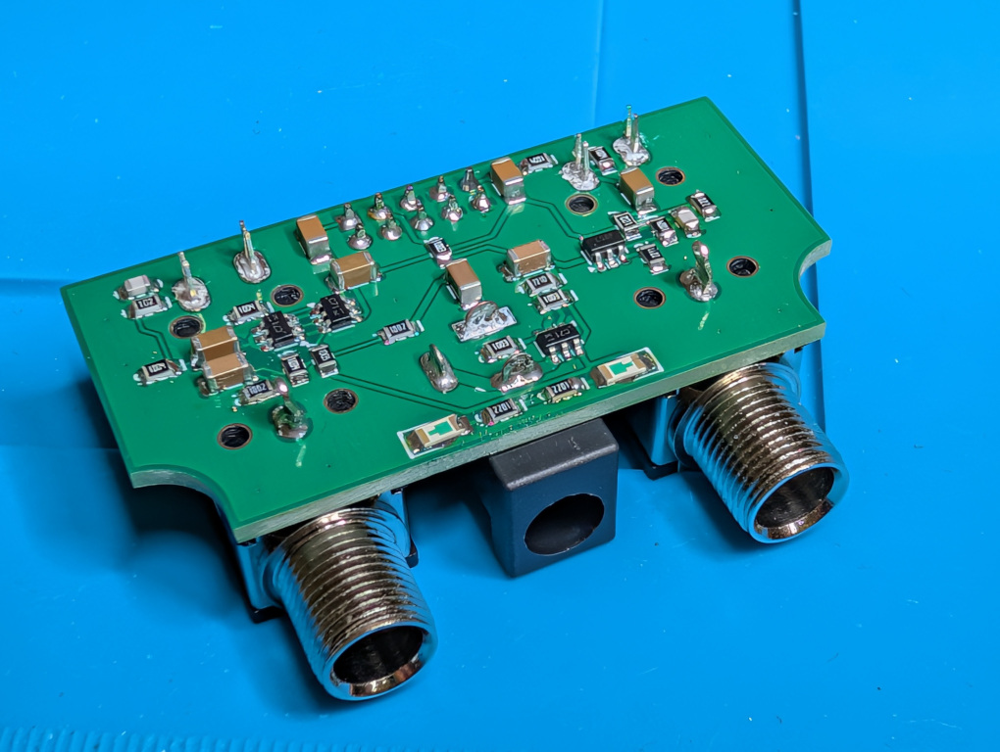
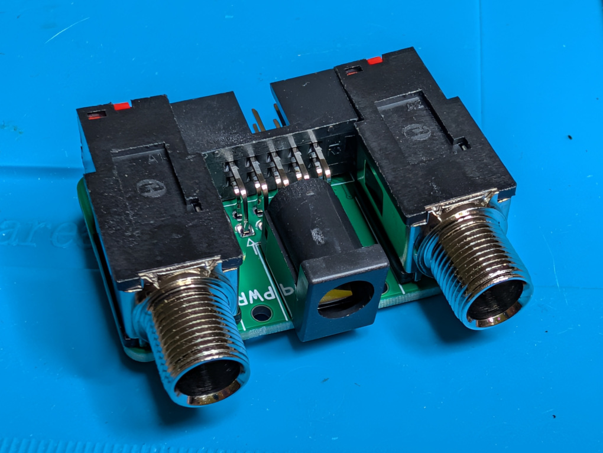
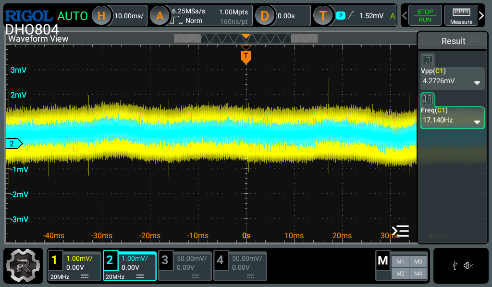
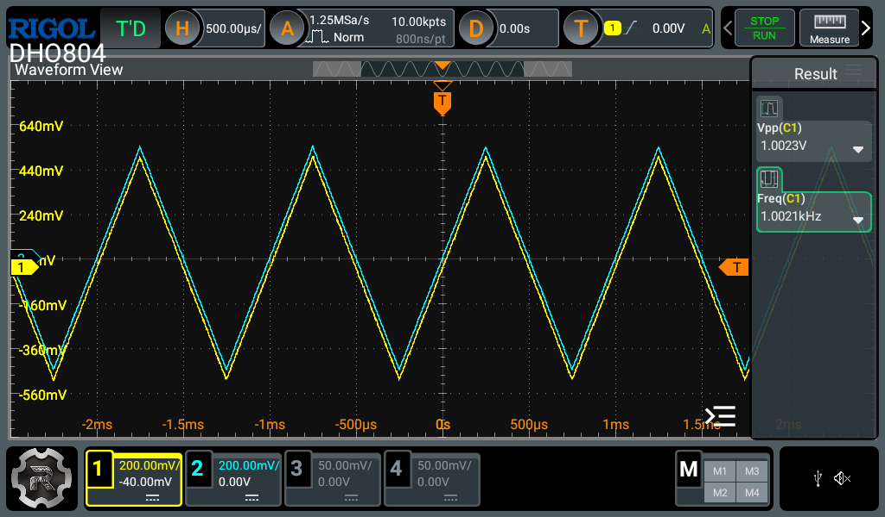
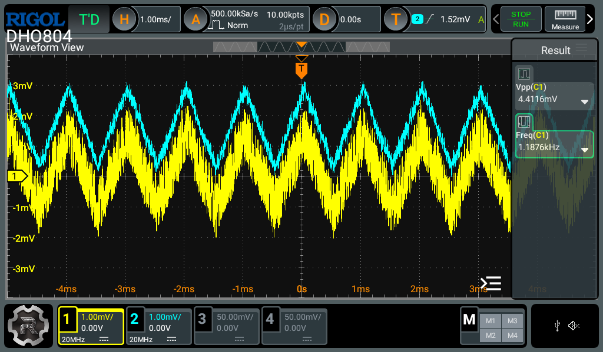
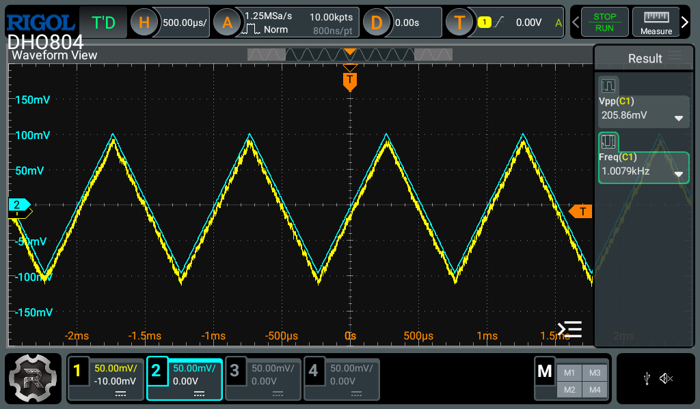
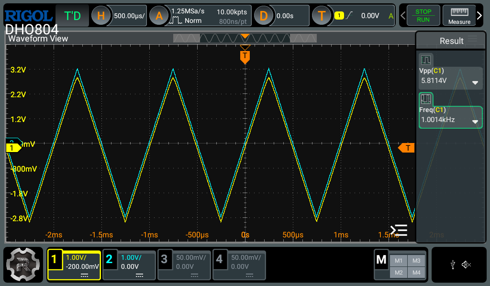
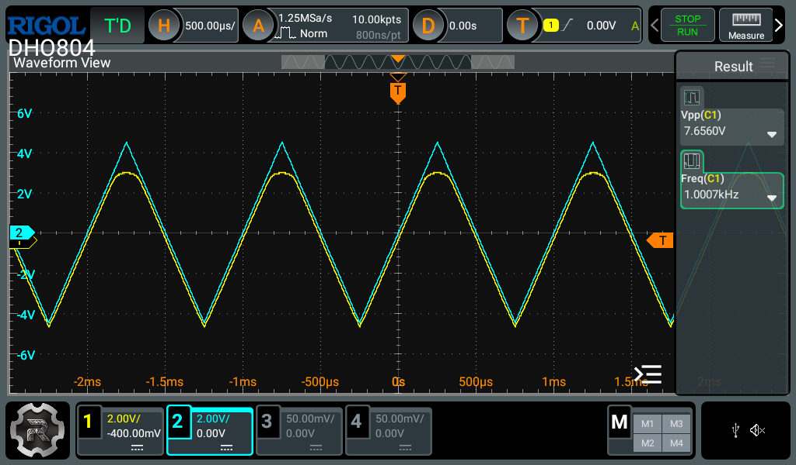
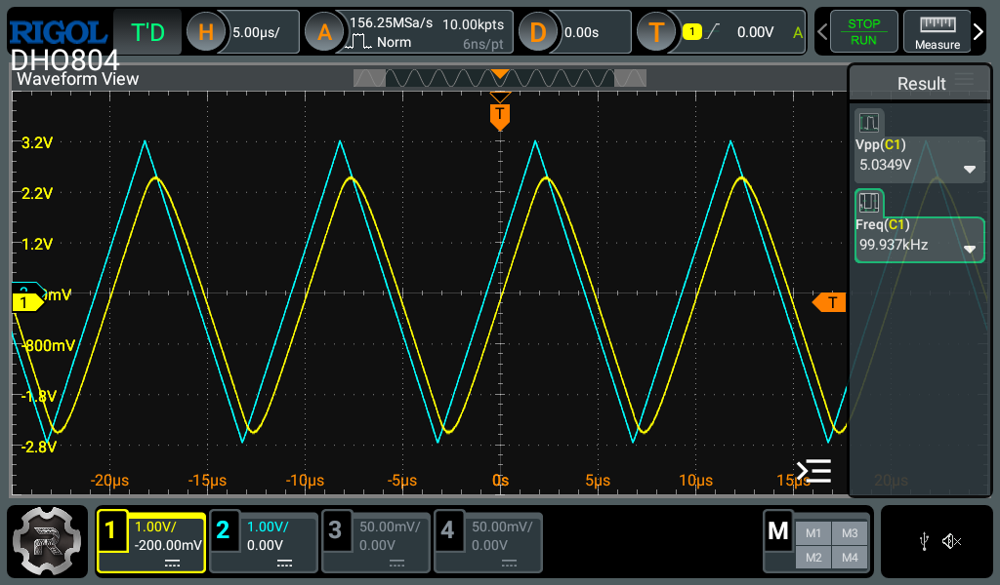
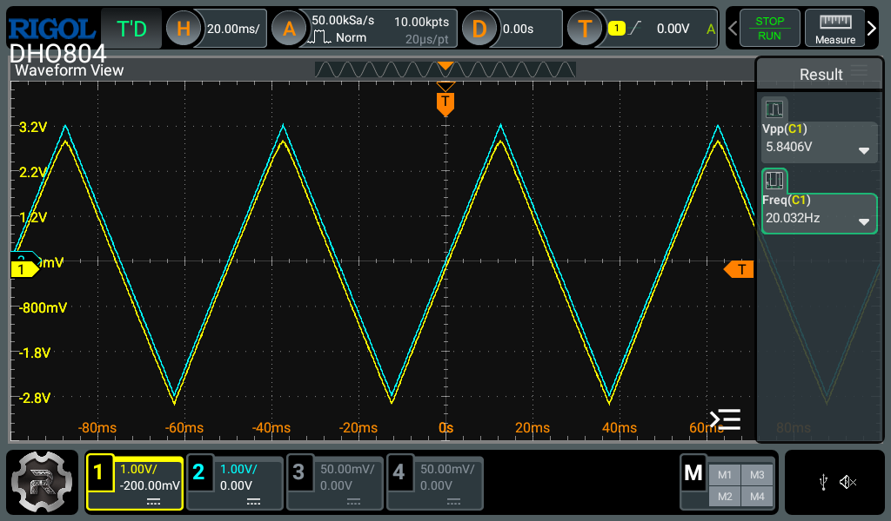

## Notes on signal passthrough

### Background

My older pedal designs all did "true bypass" with the stomp switch
acting as a physical switch for the signal, so that when the pedal was
inactive the signal would just pass through the pedal without ever going
through any other component.

That obviously worked fine, but was really boring from a circuit
standpoint.  So out with that simply physical switch, and in with a
electronically buffered pedal.  Lots of commercial pedals do that, so it
can't be entirely wrong.

You can do buffering multiple ways: using an actual analog switch IC, or
typically using a JFET or a pair of MOSFETs as a switch.

Or even just not switching the signal at all, and instead just making
the actual pedal circuit have a "neutral" mode where it doesn't affect
the signal that is either triggered by the stomp switch or is just a
fundamental part of the pedal itself (eg a pure buffer pedal possibly
with just a volume knob and no stomp switch at all).

In a digital effect, a neutral mode might be done as a passthrough mode
on the codec chip, or by just having a "NULL effect" on the digital
side.  The latter is in fact the only mode that the Daisy Seed board
implements (possibly because the PCM3060 codec chip it uses doesn't even
support it, or maybe due to the PCM3060 is hooked up in "HW mode" and so
the controls aren't exposed).

In my very limited testing of the Daisy Seed, a clean passthrough
through the ADC and DAC looked fine, but added roughly 5.2ms of latency
to the signal.  I suspect an actual musician can "feel" that, but my
limited "make horrible noises on a guitar to see" certainly didn't.

But I can most definitely see it on the oscilloscope, and it just feels
wrong.  So I'm doing "proper" electronic switching.

## Implementation

The bypass path is the dual JFET LS844 used as a high-impedance buffer,
with the signal then going to the effect for processing.  At the output,
a control signal then picks either the original buffered signal or the
processed output using a few MOSFETs.

A single MOSFET is already a switch, but the inherent body diode means
that it always passes current in one direction.  Putting two of them in
series with the body diodes in opposite directions solves that issue.
So to switch two signals you need four MOSFETs.

I'm using two dual complementary MOSFET packages that each contain one
P-channel and one N-channel MOSFET transistor, which means that I can
use a single control signal for them all to switch one set on, while the
complementary transistors get switched off.

So the signal path always goes through the JFET buffer, then either goes
to the effect board or not, but regardless of the path at the end the
signal passes through the MOSFET switch that picks one or the other.

Additionally, it gets biased to ground at the start and the end, and for
the MOSFET switching it gets biased to half the power rail so that the
control signal (at ground or at +9V) is emphatically outside the signal
range.

## "Pretty" pictures

This is roughly how the jacks board looks.  I say "roughly", because
these are actually two different revision of the earlier test boards:

but while I've moved things around and modified the board layout (and
outline) a bit, the circuit has stayed mostly the same.  The following
oscilloscope screenshots were taken with that "Component side" board
(the "Connector side" is a picture of just the connectors placed on an
unsoldered board with a more recent layout).

## Results

It's not quite as clean as true bypass, and I wish my measurement
environment was cleaner.  The basic noise level for my signal
measurement looks to be at around half a millivolt P-P, and I'll just
blame cabling, environmental noise, and just plain incompetence with a
signal generator and oscilloscope.

My el-cheapo signal generator also seems to have a slight DC bias,
although it's also worth noting that some of the screenshots are with an
extra bias just to have the waveforms not overlap 100%.  Because many of
them are that good.

Let's start with the not-great part: the noise.  This is the
oscilloscope screenshot of a 0Hz signal from my signal generator, with a
vertical scale of 1mV per division and both channels limited to a 20MHz
bandwidth:

on the screenshots the input signal is on channel 2 in cyan, with the
output on channel 1 in yellow.  You can see that the noise band on the
output is bigger than on the input, but it's all high-frequency noise,
and it's not horrible.  The measurements say 4mV+ PtP.  Not great, but
none of it is audible.

I can clean a lot of it up with more aggressive low-pass filters, but
for now I've only done some very basic RF filtering on it all.

Anyway, with that out of the way, let's look at the better part of the
story.

I'm using a triangle wave for testing, because that visualizes
non-linearities well - it's much harder to judge how good a pure sine
wave is - and tends to also show any frequency issues.

Basic 1kHz signal, 1V peak-to-peak:

note the -40mV bias on the output signal - without that you don't see
two signals at all because they overlap pretty much perfectly.  The
oscilloscope says "1.0023V" peak-to-peak measurement, but that's
literally just from the noise.  It's basically perfect.

Staying at 1kHz, this shows a 2mV PtP signal input just to show how the
noise looks on a small signal that is in the same ballpark:

so it's still clearly a triangle wave at the output, despite the noise.

A more realistic signal level for guitar might be 200mV PtP, still at
1kHz but now artificially made worse by disabling the 20MHz bandwidth
limit on the oscilloscope:

So it does ok on that 1kHz signal in the sub-1V range. What about other cases?

Here's a stress-test: 6V PtP with a 9V supply, still at 1kHz:

note the -200mV offset on channel 1, because without that it would still
basically look like a single signal.  There's a slight dip on the peak,
but honestly, it looks quite good to me.  So let's take a look at where
it really starts failing.

Ok, it's most definitely not rail-to-rail in 9V, but I think I've seen
real op-amps that do worse than this.  That's obviously a very rounded
top of the waveform, but a 9V signal is not realistic and I'll take this
as a decisive win.

Going back to a more relevant worst-case 6V PtP signal (ok, still not at
all realistic, but since it looks find, why not?, here's the 20kHz
signal:

and you can see the same slight rounding of the top of the signal and it
has maybe lost a tiny bit of sharpness of the triangle wave, but keep in
mind that a 20kHz triangle wave has a lot of higher-frequency harmonics,
so that's part of it.

How high will it go? At 100kHz, the RF filtering is starting to really
show some attenuation of the higher harmonics, and you see more rounded
peaks and it's not looking like a sharp peak any more.  But remember:
this is 100kHz, just checking the circuit, not relevant for audio:

The above basically tells me that I need to do a lot more high-frequency
filtering, but for checking that the signal path is at least able to
comfortably handle any signal in the audio range, it looks good.

Going the other way is more relevant, because bass frequencies can get
filtered out by bad AC coupling.  So here's that same 6V PtP but at
20Hz:

Still looks linear with straight lines and no sagging.

Anyway, if anything, I will need to add more low-pass filtering: the RF
filters that the jacks have will filter out radio noise, but clearly it
wouldn't hurt to be much more aggressive to get rid of power supply
noise etc.

It's also worth noting that these screenshots were taken without any
actual effect board connected.  In past experiments, the Daisy Seed
output has been very noisy indeed and it needs a lot of filtering to
look good on an oscilloscope.  So this is all the baseline performance
just from the core input buffer and the output switching.

