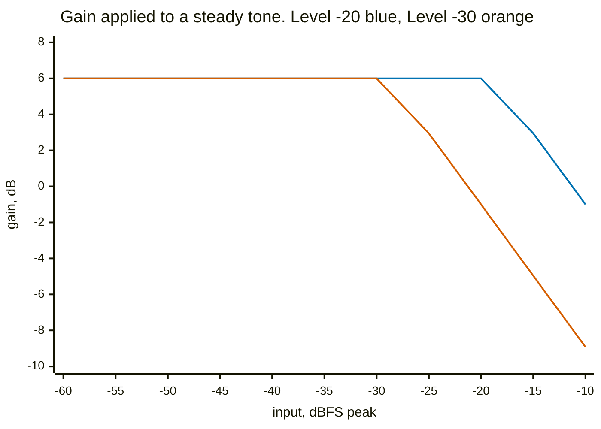
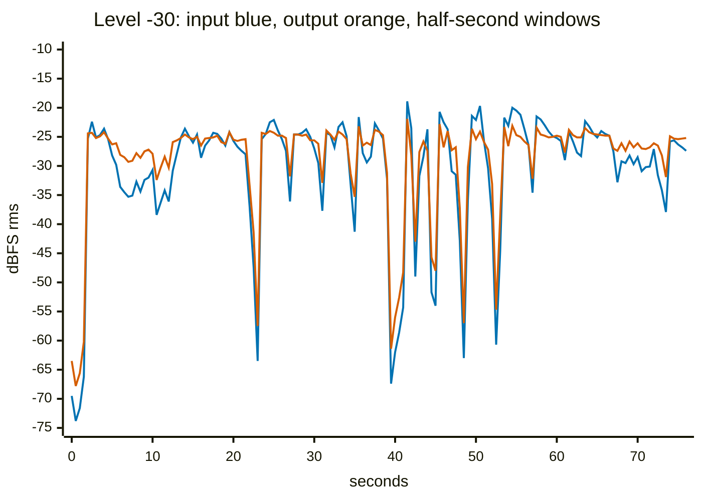
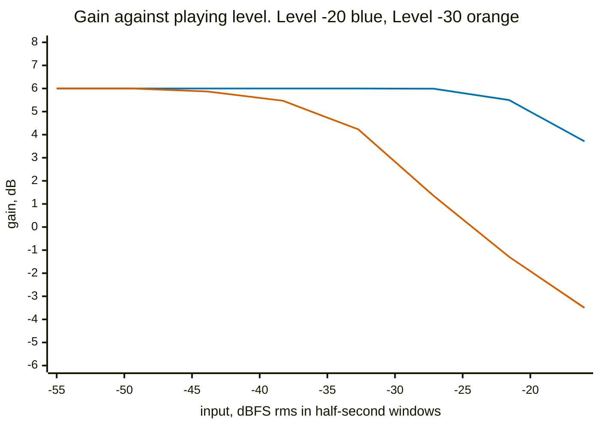
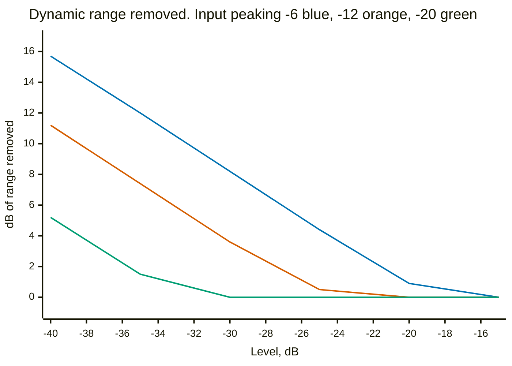
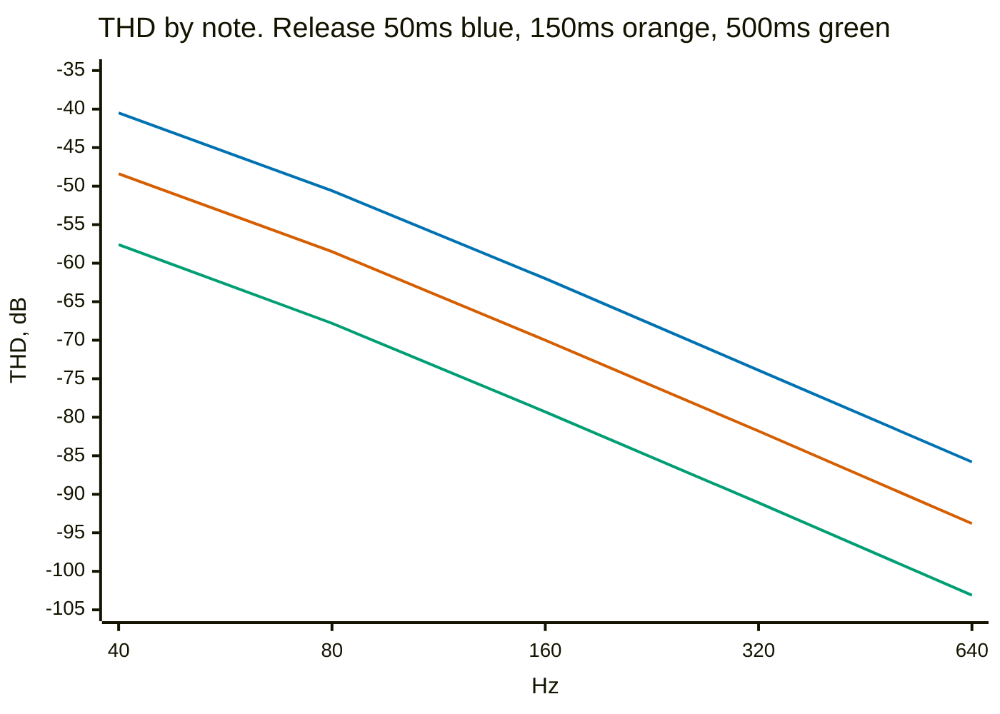
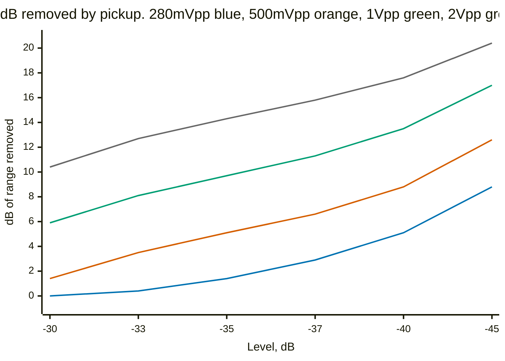

# Compressor `[COMPRESSOR]`

Five controls: **Level** (−60..−10 dB, the threshold), **Attack** (2..100 ms),
**Release** (50..500 ms), **Ratio** (1..20×) and **Boost** (0..24 dB, makeup
gain). Defaults are −35 dB, 15 ms, 150 ms, 4.8× and 6 dB.

The arithmetic is short enough to state. An envelope follower tracks the
rectified input with those attack and release times; above the threshold the
gain becomes `(level/env)^(1 − 1/ratio)`, slewed to avoid clicks; and the
result is multiplied by Boost whatever happens. **So Boost is unconditional
and compression only ever subtracts** — quiet playing gets the makeup gain and
nothing else, loud playing gets the makeup gain minus whatever the ratio takes
away.

## The static answer, which is exact and not very useful

A steady tone at a series of levels, measuring the gain the compressor
settles on:



The knee sits exactly where Level says, and above it each 5 dB of input buys
1.04 dB of output — a ratio of 4.81, against the 4.8 on the pot. Nothing is
wrong with it.

It is also nearly worthless as a description of the effect, which is why this
page does not stop here. A compressor's whole job is changing its gain over
time in response to a signal that changes over time, and a tone that never
changes measures the one case that never happens.

## The dynamic answer

`Inputs/BassForLinus.mp3` is a friend of mine playing scales on a bass, 77
seconds of real dynamics. It is committed unmodified, so it matches the copy
it came from.

**The level it is played at is a measurement choice, not a detail.** The mp3
decodes to **+2.86 dBFS** — reconstruction overshoot on a master that was
already close to full scale — so used raw it would clip the pedal's input
before the compressor saw any of it. It is scaled to −6 dBFS peak, which is
where an instrument track is usually aimed, giving −25.9 dBFS RMS over the
whole take. A quieter input crosses the threshold less often and everything
below moves with it.



That is the picture a tone cannot give. The blue line wanders over 50 dB; the
orange one spends most of the take between −24 and −28 dB. The passages the
player left quiet come up, the loud ones are held, and the shape of the phrase
survives — the orange line still rises and falls, it just does it over a
quarter of the range.

The silences are the exception and they are correct: where the input drops to
−67 dB between takes, the output sits 6 dB above it, because there is nothing
to compress and the makeup gain is unconditional. A compressor lifts the noise
floor between notes; this one is honest about it.

## What the threshold is worth

The same recording, gain plotted against how loud the playing was, at two
threshold settings:



At −20 dB, against this recording at this level, the effect never applies less
than +3.0 dB and never more than +6.0 — the blue line is flat until the loudest
few seconds and then bends slightly, which is a boost with a hint of
compression on top. The orange line, ten decibels down, is what a compressor's
transfer curve is supposed to look like: +6 dB on the quiet passages falling to
−3.5 dB on the loud ones, about 10 dB of range squeezed out of the performance.

Neither is right or wrong. Which one you get depends on how loud the signal
arriving is, and that is a thing the player sets — with Trim, with a boost, or
with whatever pedal is in front. What the threshold does is fix the distance
between the two.

**A caution about reading the two transfer curves together**: they do not
share an x-axis. The static one is the peak amplitude of a sine; this one is
half-second RMS of a bass. Those differ by the crest factor, which for plucked
bass is a good 12 dB, so the knee appears in a different place on each and
neither is wrong.

## What the knobs are worth

The threshold is compared against an envelope of the input, so how much any
setting does depends entirely on how hot the instrument is. That makes "is
this default any good" a question with three different answers:



**At a realistic instrument level the default threshold does nothing at all.**
A guitar around 0.1 V RMS lands near −12 dBFS peak once its crest factor is
allowed for, and on that middle line the default −20 dB removes 0.0 dB of
dynamic range. You have to be at −35 before it takes out a useful 7 dB, and
−35 is most of the way to the bottom of a pot that stops at −40.

The top half of the Level control — everything above about −25 — does nothing
for any input a guitar produces.

## Attack and release cost low notes

A fast envelope follows the waveform rather than the note, and modulating the
gain at the note's own frequency is distortion. It is a bass problem far more
than a guitar one: the penalty falls about 11 dB per octave.



At the default 150 ms, a guitar's low E measures −58.5 dB and a bass low E
−48.4 dB. So the default is comfortable for the instrument this pedal is for
and marginal for the one an octave below it. Dropping to 50 ms costs 8 dB
everywhere and takes bass low E to −40.5 dB, which is audible.

Attack barely matters here by comparison — the whole 2 ms to 100 ms range
moves THD by 5 dB — while it does change how much gets squeezed, from 9.9 dB
at 2 ms to 4.3 dB at 100 ms. So attack is close to a free control and release
is not.

Ratio is nearly free above about 8: at Level −30 it buys 8.8 dB of squeeze at
8:1 and 9.4 dB at 20:1, against 8.2 dB at the default 4.8.

## What the defaults are, and why

**These were made up.** The controls were given plausible-sounding numbers when
the effect was written and had never been measured. The ranges too.

Measuring changed one of them. Because the response is a pure translation, the
end of the pot is a wall: with the old `LINEAR(-40 0)`, a guitar arriving at
about −20 dBFS peak could not get more than roughly 5 dB of compression at any
setting, simply because the knob stopped. The range is now `LINEAR(-60 -10)`,
which costs 0.42 dB per step against 0.33 and forecloses nothing.

With that room, here is what each candidate default does to the instrument
somebody actually plugs in — no trim, nothing in front:



Peak-to-peak volts convert through `process.h`: a sample is the instantaneous
volts over √2, because 1.0 is a 1 Vrms sine peaking at 1.414 V. So the README's
"typical" 280 mVpp is −20.1 dBFS peak, and a hot pickup at 500 mVpp is −15.1.

**−35 dB** is the default, and two things pick it. It gives 5.1 dB of reduction
on a hot pickup and 9.7 dB on a humbucker — a compressor doing something the
moment you switch it on, which is presumably why you switched it on. And it
sits at exactly mid-travel on the new range, so the knob's centre is the
sensible setting and both directions mean something.

It is deliberately gentle on a quiet single-coil, 1.4 dB. That is what the 25 dB
of travel below it is for.

The other four hold up. Ratio is in the useful part of its curve at 4.8 and
nearly free above 8. Attack costs 5 dB of THD across its whole range while
changing the squeeze by more than twice that. Release is right for guitar and
marginal an octave below.

## Reproducing this

```
cd Validation
make bench          # a stale bench measures a pedal you no longer have
./analyse-compressor.py
```

Needs `ffmpeg` for the decode. That decode is deterministic for a given
ffmpeg, and the script prints the sample count, raw peak and scaled RMS
first — if those move and nothing else changed, the decoder did.
