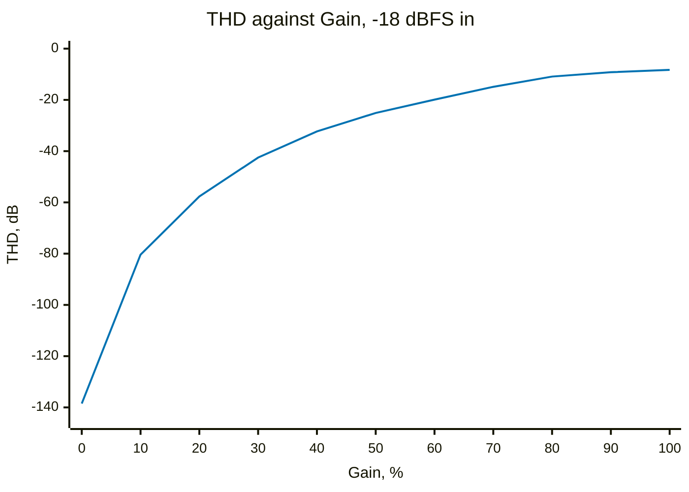
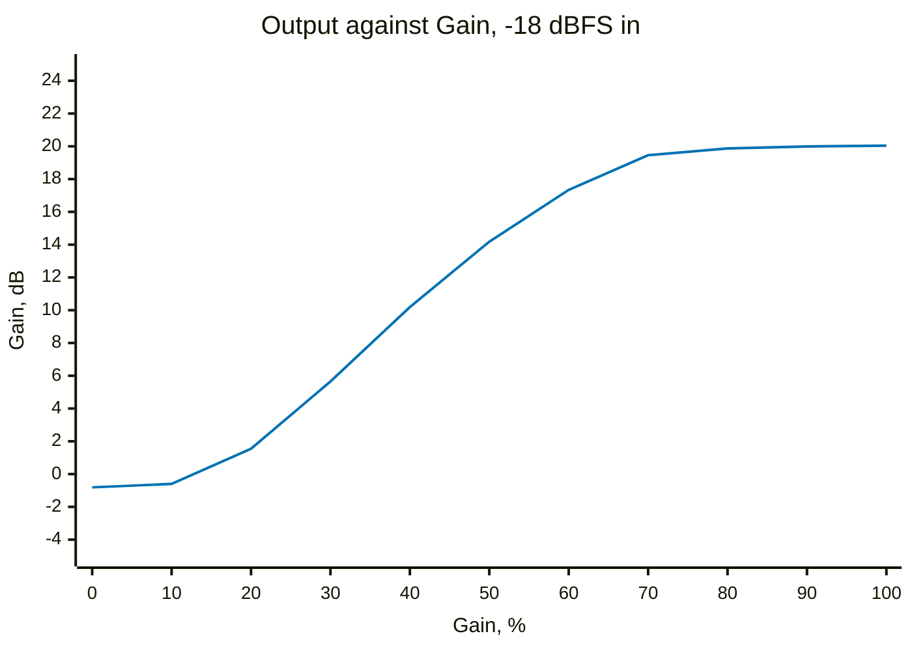
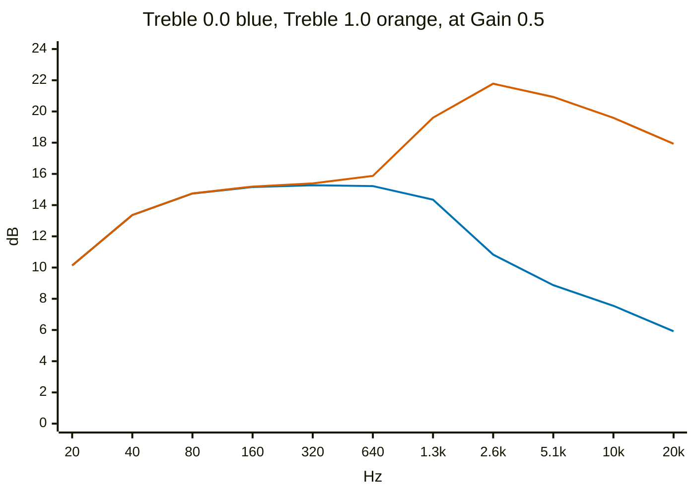
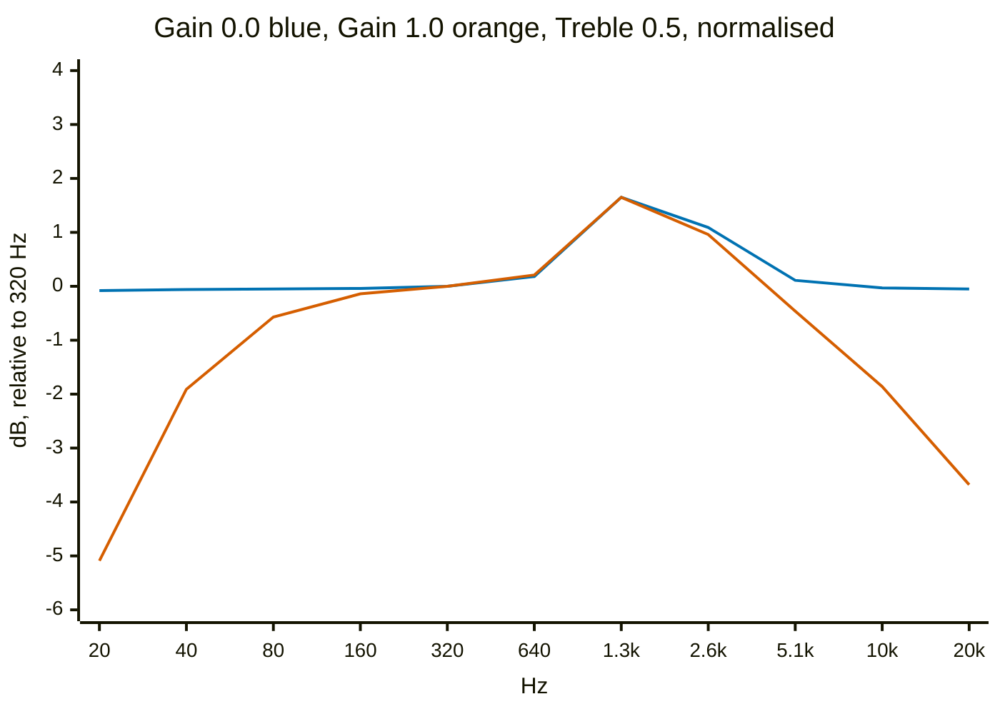

# Klonlike `[KLON]`

A model of the Klon Centaur, originally written by Bryan Leavelle. Three
controls — **Gain**, **Treble**, **Output** — all `LINEAR(0 1)`.

The circuit it models: a charge pump for 18V of headroom, an input buffer, an
op-amp driving a germanium diode pair to ground, and a clean/dirty blend that
tracks the gain knob rather than being a mix control of its own. The treble
control is a shelf with a presence peak below it.

**The signature is the blend.** On a real Centaur the clean and clipped paths
are summed by a dual-gang gain pot, so turning up the gain does not just add
distortion, it *removes the clean signal*. At low gain you get a clean sound
with an edge on it; at maximum there is no clean path left. That is the whole
character of the pedal and the model does reproduce it.

All numbers here are measured, not calculated, by `Validation/analyse-klon.py`
driving the pedal's own audio core on the host. `make check-analysis` re-runs
them and says if the code has moved underneath this page.

## What the Gain knob does

Output and distortion against Gain, with a −18 dBFS tone in — about what a
guitar actually produces.





Two things worth reading off those. **The output curve flattens after about
0.7** — the last third of the knob is almost all distortion and almost no
level, which is what you want from a drive pedal and is a fair reproduction of
the real thing. And **at Gain 0 the effect is essentially a wire**, −0.81 dB
and −138.5 dB THD, so it can be left in the chain switched down.

## The Treble control

Small-signal response at Gain 0.5, with Treble at each end.



The two ends differ by 11 to 12 dB above 2 kHz and are within 0.15 dB of each
other below 640 Hz, so it is a treble control and not a tilt. The peak at
2 kHz on the bright setting is the 1.7 kHz presence filter riding on the
shelf, which is why it sits above its own centre frequency. The model doubles
the peak's boost relative to the shelf, which the comment in the source notes
was true of the original code too.

## What it gets wrong

Two things, both filed.

**It cannot produce even harmonics at all.** The clipper is `tanhf()`, which
is odd, and nothing in the signal path breaks the symmetry — measured even
content is `0.00 %` at every gain setting, from 0.0 to 1.0. The comment in the
source says germanium hard clipping "gives even harmonic content from the soft
knee", and a real mismatched diode pair does. This one does not, and even-order
content is most of what people mean when they call a drive "warm" rather than
"fuzzy".

**The clean path skips every input filter.** `klon_step()` builds a
conditioned signal — DC blocker, 30 Hz coupling capacitor, 15 kHz input
bandwidth — and then blends the *raw* input with the clipped one, not the
conditioned input. So all three filters exist only in the dirty half, and the
gain knob moves the frequency response as a side effect:



At Gain 0 the response is flat to 20 Hz and flat to 20 kHz — no coupling
capacitor and no bandwidth limit anywhere. At Gain 1.0 the same filters are
fully present, 5.1 dB down at 20 Hz and 3.7 dB down at 20 kHz. On the real
Centaur both halves come off the same input buffer through the same coupling
cap, so the split happens after the input stage, not before it. One character
in the source — blending `pre` instead of `in` — but it changes the voicing at
every setting below maximum.

## What it gets right

- **The blend really is a gain-tracked crossfade**, not a mix knob, and the
  clean path really does ground out as the gain comes up.
- **The knee is soft.** The level sweep at Gain 0.7 shows THD rising smoothly
  from −96 dB at −60 dBFS to −7 dB at 0 dBFS with no discontinuity, and the
  waveform corner sharpness stays near 1.5 until the signal is loud enough to
  fold, which is germanium-like rather than silicon-like.
- **It stays clean when it is told to.** −138.5 dB THD at Gain 0.

One caveat for the top of the knob: aliasing rises from −123 dB at low gain to
**−50.7 dB at Gain 1.0**, because the clipper generates harmonics well above
Nyquist and there is no oversampling. That is audible as a hard edge rather
than as recognisable tones, and it is worst exactly where the input bandwidth
limit is bypassed by the issue above.

## Reproducing this

```
cd Validation
make bench          # a stale bench measures a pedal you no longer have
./analyse-klon.py
```
