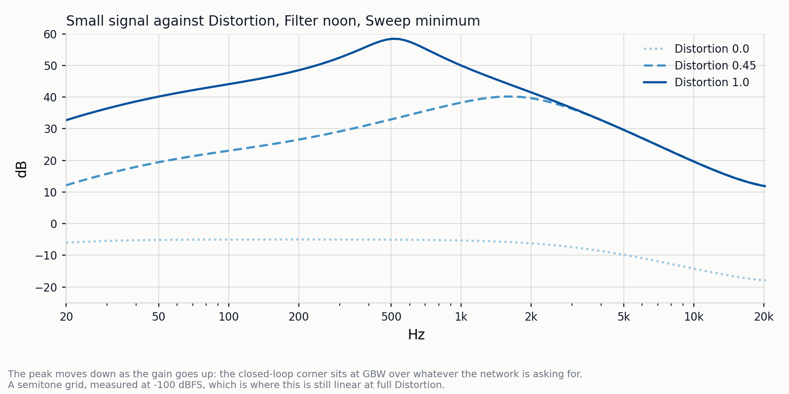
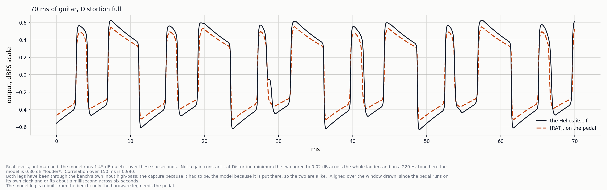
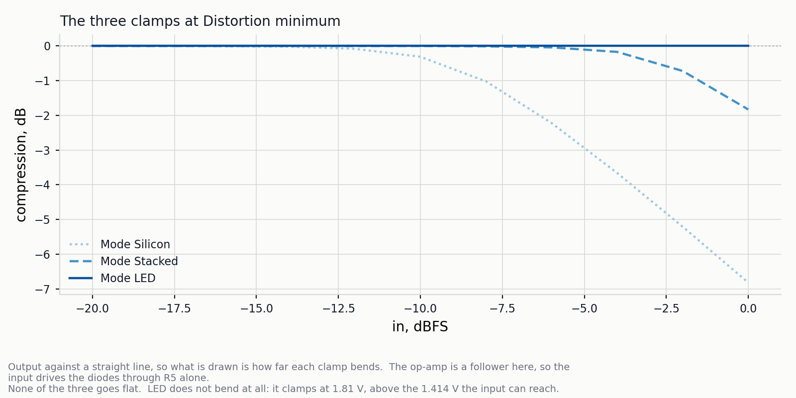
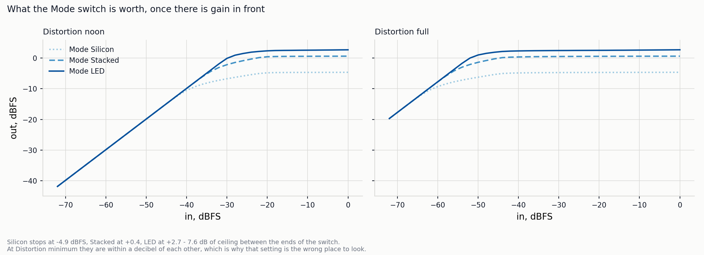
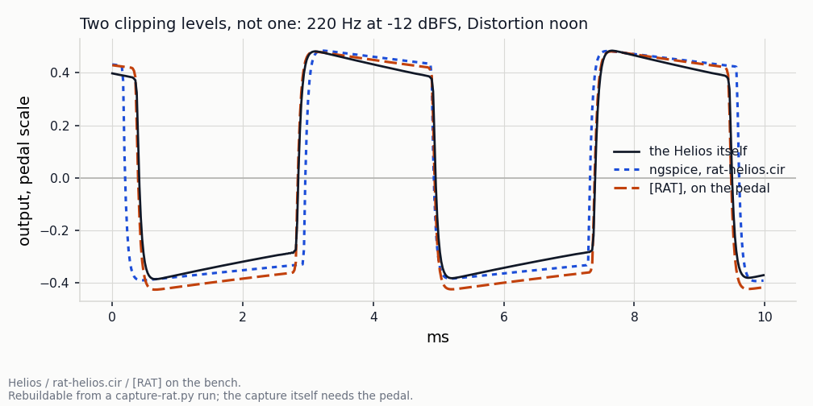
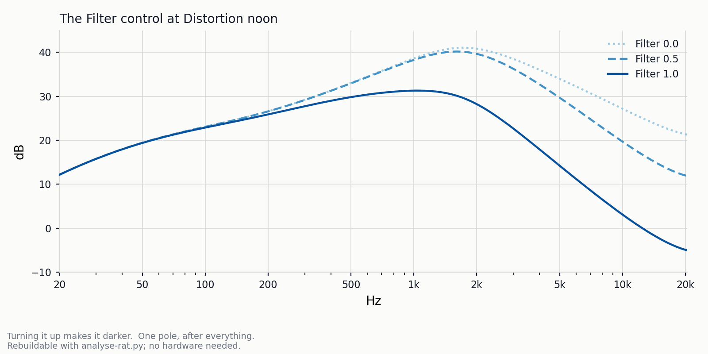
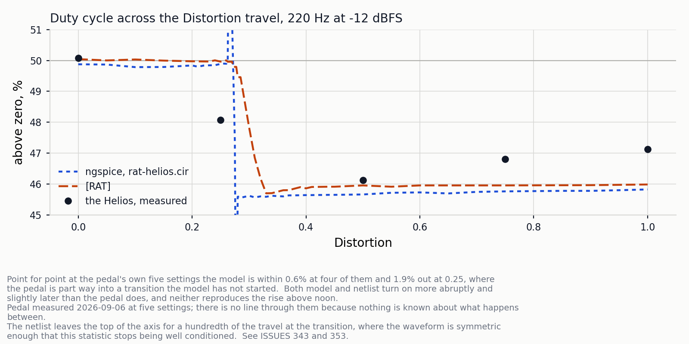

# Rat Sketch `[RAT]`

A model of the ProCo RAT: one op-amp with a great deal of gain, a diode clamp
on its output, one pole of treble cut and a buffer. There are no transistors in
the signal path, so the whole pedal is a feedback network, two diodes and a
filter — which makes it the distortion here with the least in it, and so the
one where what is left is the argument.

Five controls. **Distortion** and **Filter** and **Volume** are the pedal's
own; **Sweep** and **Mode** are the Helios's additions, described below.

Every figure here is drawn by `Validation/draw-rat.py` from measurements made
by `Validation/analyse-rat.py`, which drives the pedal's own audio core on the
host. The numbers behind each one are kept in the source of this page, in
comments, and `make check-analysis` re-measures them and says if the code has
moved underneath the drawing — so a figure can be as detailed as it needs to be
without the record stopping being text. Comparisons against the hardware and
against ngspice carry their date instead, because neither runs on a laptop.

## Which RAT this is, and why that is the first question

**There is no such thing as "the" RAT**, and this matters more here than it
would for most pedals, because the two things that vary between versions are
the two things this model is mostly about: the op-amp and the diodes.

The reference is an **Aion FX Helios Vintage Distortion** — a documented kit,
built, on the bench, with an OP07CP read off the board. It was chosen because
it was to hand and because a kit comes with a schematic, which is the
difference between measuring a circuit and guessing at one. Every fitted number
in `Effects/rat.h` came off that unit on 2026-09-06.

**The op-amp is a version, not a detail.** The original 1978 RAT used an
LM308N, externally compensated with the 30 pF cap between pins 1 and 8 that
every RAT schematic shows. Pro Co began phasing it out around 1995 and post-1996
RAT 2s carry an OP07, which is internally compensated and needs no such cap.
So the Helios's OP07CP is not a deviation from a RAT — it is what a modern one
has, and this model is faithful to that generation rather than to the first.

That is the version dependency worth taking seriously, because of what the
op-amp turned out to be worth. Giving it a real gain-bandwidth instead of an
ideal one moved this model 7.9 dB at 5 kHz with the Distortion at noon and
22.8 dB at the top of the travel, and at full Distortion it was **audible in a
blind test** — level-matched and shuffled, three takes ordered correctly by
brightness. An LM308 RAT would want that one number refitted and, on the
evidence, very little else: `RAT_GBW` is fitted at 460 kHz for this OP07, and
the whole closed-loop corner falls out of it. What it would *not* need is a
different slew rate, which is the usual folklore about this part — see below.

**The diodes are the other version.** A stock RAT has one silicon pair to
ground and no switch. The Helios adds two common modifications: a **Mode**
switch selecting between three sets of diodes, and a **Sweep** control that
puts up to 1 k in series with the 47 R setting the gain, which takes the treble
emphasis away and the gain with it. Fully down, Sweep is the stock pedal.

So `Mode = Silicon` with `Sweep = 0` is a stock post-1996 RAT, and the other
positions are the mods. If you are comparing this against a different RAT, that
is the setting to compare at.

## The gain network, and the loop around it

The feedback leg is two series RC branches in parallel with the Distortion
rheostat above them, so the gain is frequency-dependent on purpose: 4.7 µF into
560 R lifts everything above 60 Hz, 2.2 µF into 47 R lifts it again above
1.5 kHz, and the Filter knob then takes the result back off. That shape is the
pedal.



<!-- measured
| dB at | 20 | 40 | 80 | 160 | 320 | 640 | 1.3k | 2.6k | 5.1k | 10k | 20k |
|---|---|---|---|---|---|---|---|---|---|---|---|
| Distortion 0.0 | -6.02 | -5.24 | -5.03 | -4.99 | -5.0 | -5.11 | -5.52 | -6.87 | -9.95 | -14.35 | -17.94 |
| Distortion 0.45 | 12.15 | 17.96 | 22.0 | 25.34 | 29.61 | 34.91 | 39.67 | 37.88 | 29.34 | 19.36 | 11.84 |
| Distortion 1.0 | 32.71 | 38.64 | 42.91 | 46.85 | 53.26 | 56.65 | 46.81 | 38.52 | 29.3 | 19.32 | 11.8 |
-->


The peak moving *down* as the gain goes up is the gain-bandwidth: the corner
sits wherever the gain the network is asking for has fallen to GBW/f, so the
knob drags it across most of the audio band — about 2 kHz at noon and down near
560 Hz at the top.

The op-amp's rails are **inside** that loop, which is where the circuit has
them and is not a formality. When it saturates the loop opens, C5 and C6 go on
charging from wherever the node was, and when it comes back out is decided by
that charge and by which rail it had been against. Two unequal rails and a
capacitive feedback leg make a duty cycle, and for a clipped wave the duty
cycle *is* the even harmonics: H2/H1 is `|cos(πd)|`, which is nothing at all at
a half.

| 220 Hz, −12 dBFS, Distortion full | duty | H2 | H3 |
|---|---|---|---|
| the Helios | 46.83 % | −19.6 dB | −10.1 dB |
| `rat-helios.cir` | 45.96 % | −14.9 dB | −10.8 dB |
| **this model** | **45.99 %** | **−17.9 dB** | **−11.2 dB** |
| this model, rails outside the loop | 49.96 % | −55.2 dB | −9.7 dB |

Those are the softest numbers on this page, and it is worth saying by how
much. They come from a scope reading of the op-amp's own output, good to
something like a tenth of a volt, and a tenth of a volt on the upper rail is
worth 0.29 % of duty and 0.65 dB of H2. The remaining disagreement with the
pedal is 0.8 % and 1.7 dB — larger than that, but the same order, so the
right conclusion is that the mechanism is present and correctly signed rather
than that it is calibrated.

That is a table of one number each. The reason to believe it is a picture:



Seventy milliseconds of real playing at full Distortion, at real levels rather
than matched. The model's plateaus tilt down at the pedal's rate and its zero
crossings are the pedal's; over 150 ms the two correlate at **0.990**.

It is also **1.45 dB quieter**, and that is drawn rather than normalised away.

It is not a gain constant. At Distortion minimum, where the op-amp is a
follower and the input network, the clamp curve, the follower and the output
network are the whole signal path, the model matches the pedal to **0.02 dB
across the entire level ladder**. Nor is it the source the pedal is driven
from, whose 1 kΩ output impedance against a 690 kΩ input costs 0.021 dB and is
flat across the band.

Driven with the pedal's own recorded stimulus, windowed identically, at full
Distortion:

| 220 Hz burst | rms | crest | plateau droop |
|---|---|---|---|
| the Helios | −8.46 dB | 1.69 dB | **2.17 dB** |
| this model | −7.66 dB | 1.36 dB | **1.27 dB** |

So on a tone the model is 0.8 dB *louder*, and it has **about half the
pedal's droop** — the tilt away from the rail across each clipped plateau,
which is what the waveform above shows. That holds at every drive level tested.
A flatter plateau is less peaky for the same energy, and on broadband material,
where the level never settles and the tilt is being re-established constantly,
it comes out 1.45 dB the other way.

The droop is C7 charging through the diodes, and **most of the apparent gap was
the bench**. A capture reaches the analysis through the pedal's own analog
input, whose coupling capacitor into the codec is a single-pole high-pass at
9.28 Hz.[^rig] Taking it back out — so the numbers are what an ideal capture
would have caught — leaves this:

| plateau droop | 82 Hz | 165 Hz | 220 Hz | 440 Hz |
|---|---|---|---|---|
| the Helios, corrected | 3.80 dB | 1.89 | 1.40 | 0.71 |
| this model | 3.72 | 1.82 | 1.33 | 0.57 |
| `rat-helios.cir` | 2.27 | 1.53 | 1.13 | 0.52 |

So the model is under 0.15 dB short of the pedal across 2.4 octaves rather
than half of it, and the netlist is further short than the model. What remains
is small and unattributed.

The op-amp's rails are not the explanation, and they are the obvious place to
look: they are measured rather than fitted, a scope on pin 6 reading the output
stopping 0.89 V short of the supply and 1.56 V short of ground. That trace
settles the larger question too — at full Distortion the plateaus are flat, top
and bottom — so whatever tilts this pedal's clipped half cycles, the amplifier
does not.

The rest was excluded the same way, all by measurement: C7's value (4.1 µF in
circuit), R5's (1 kΩ), the diode saturation current (×30 moves the droop
0.17 dB), its ideality (1.86 to 3.5, another 0.17), C7 leakage (300 µA moves
it 0.01 dB) and the Filter branch (0.6 % of the current).

The level is a separate question and the correction does not touch it: +0.8 dB
on a tone and −1.45 dB on a chord, pole in or out.

[^rig]: 9.28 Hz is measured, not assumed — `Validation/test-loop.py` fits it and
    it has held across three board generations, predicted before the third was
    built. It is 0.008 dB at 220 Hz, so no level, ladder or harmonic
    measurement here has ever needed to care about it. In the time domain it is
    not small: τ is 17 ms, so a value held across a 2.27 ms half cycle decays
    12 % and a clipped flat top tilts 1.1 dB. `loop.uncolour()` takes it back
    out, which is what makes a number describe the pedal rather than the pedal
    and this bench together. The real fix is hardware and is planned rather
    than done: DC-coupling the codec inputs removes the pole, and the
    next-generation board wants that anyway for its headphone amplifier — with
    a 1 MΩ input and only a DC blocking capacitor in front of it, what is left
    is too small to correct for.

The netlist is not drawn here, and that is worth saying rather than passing
over: on this material it correlates with the pedal at 0.574, so the model is
the better description of the Helios than `rat-helios.cir` is. The deck is
right about tones — it is what most of the constants on this page were fitted
against — and wrong about a chord, by an amount no tone measurement would have
found.  That is a defect in the netlist rather than in this model, and it
is not chased here.

## A diode has no clipping level

The clamp is not a limit. A diode's drop is the logarithm of its current, so
the node keeps climbing about a hundred millivolts a decade for as long as the
drive keeps rising. At Distortion minimum the op-amp is a follower and the
input drives the diodes through R5 alone, which is the one place that curve is
visible from outside the pedal:



Drawn as compression — output against a straight line — because what matters is
how far each bends and that none of them stops bending. Raw, all three are a
diagonal with the interesting part squeezed into the last few decibels.

<!-- measured
| dB at in dBFS | -20 | -18 | -16 | -14 | -12 | -10 | -8 | -6 | -4 | -2 | 0 |
|---|---|---|---|---|---|---|---|---|---|---|---|
| Mode Silicon | 0.0 | -0.0 | -0.01 | -0.02 | -0.08 | -0.31 | -1.02 | -2.22 | -3.66 | -5.21 | -6.82 |
| Mode Stacked | 0.0 | -0.0 | -0.0 | -0.0 | -0.0 | -0.0 | -0.01 | -0.04 | -0.17 | -0.72 | -1.83 |
| Mode LED | 0.0 | 0.0 | -0.0 | 0.0 | 0.0 | -0.0 | 0.0 | 0.0 | 0.0 | -0.0 | -0.0 |
-->


None of the three goes flat, and that is the point rather than a detail of the
drawing. Measured on the pedal at 1 dB steps, the last decibel before full
scale still moves the output **0.21 dB**. A curve that goes flat above a knee
cannot do that, and what it costs is visible: the flat top of a clipped note
stops tilting as the note decays.

That figure is also the one setting where the **Mode** switch looks pointless,
which it is not. Put some gain in front and the three positions separate by
7.6 dB of output ceiling:



<!-- measured
| dBFS out at in dBFS | -72 | -60 | -48 | -36 | -24 | -12 | 0 |
|---|---|---|---|---|---|---|---|
| Mode Silicon at noon | -41.89 | -29.89 | -17.89 | -8.49 | -5.4 | -4.67 | -4.63 |
| Mode Stacked at noon | -41.89 | -29.89 | -17.89 | -5.99 | -0.31 | 0.59 | 0.64 |
| Mode LED at noon | -41.89 | -29.89 | -17.89 | -5.89 | 1.94 | 2.57 | 2.71 |
| Mode Silicon at full | -19.72 | -9.28 | -5.79 | -4.77 | -4.69 | -4.66 | -4.63 |
| Mode Stacked at full | -19.72 | -7.75 | -0.79 | 0.47 | 0.57 | 0.61 | 0.64 |
| Mode LED at full | -19.72 | -7.72 | 1.55 | 2.42 | 2.52 | 2.6 | 2.72 |
-->

The three positions are not three heights of one mechanism. LED clamps at
1.81 V, which is *above* the 1.414 V this pedal's input can reach, so at unity
gain the LEDs never conduct at all — the green line is the linear chain and
nothing else. Silicon at 0.61 V sits far below the op-amp's rails and dominates
completely. Stacked is between. The two red LEDs are across the node in all
three positions; they contribute nothing to the other two, four decades down
where the silicon passes milliamps.

Magnified onto a single clipped edge, at Distortion noon where the clamp and
the rails are both in play:



The diode law is fitted to the pedal, not to the netlist:

| | this pedal | `rat-helios.cir` |
|---|---|---|
| N | 1.859 | 1.752 |
| Is | 2.03 nA | fitted |
| Rs | **31 Ω** | absent |

Where the 31 Ω lives is not settled. A 1N914's own bulk resistance is
single-digit ohms, so most of it is the Mode switch's contacts or the JFET
follower sagging at large signal, and those look identical from outside. Only
the diode's own share should double in the Stacked position, so it is not
doubled — a choice recorded rather than a measurement.

## The Filter runs backwards

One pole, and turning it up makes it darker. It is the only tone control and it
is after everything, so it removes treble the gain network has already made
rather than shaping what the diodes see.



<!-- measured
| dB at | 20 | 40 | 80 | 160 | 320 | 640 | 1.3k | 2.6k | 5.1k | 10k | 20k |
|---|---|---|---|---|---|---|---|---|---|---|---|
| Filter 0.0 | 12.15 | 17.96 | 22.0 | 25.35 | 29.65 | 35.05 | 40.2 | 39.64 | 33.75 | 26.94 | 21.26 |
| Filter 0.5 | 12.15 | 17.96 | 22.0 | 25.34 | 29.61 | 34.91 | 39.67 | 37.88 | 29.34 | 19.36 | 11.84 |
| Filter 1.0 | 12.14 | 17.93 | 21.88 | 24.88 | 28.02 | 30.57 | 31.08 | 25.06 | 13.81 | 2.74 | -5.08 |
-->


## What it gets wrong

**The asymmetry turns on more abruptly than the pedal's.** Across the
Distortion travel both this model and the netlist switch their asymmetry on
between 0.25 and 0.30, where the pedal is already part way into it at 0.25:



<!-- measured
| % at Distortion | 0.0 | 0.1 | 0.2 | 0.3 | 0.4 | 0.5 | 0.6 | 0.7 | 0.8 | 0.9 | 1.0 |
|---|---|---|---|---|---|---|---|---|---|---|---|
| duty above zero % | 50.04 | 50.03 | 49.97 | 47.84 | 45.86 | 45.95 | 45.95 | 45.95 | 45.96 | 45.96 | 45.99 |
| H2 | -106.9 | -121.2 | -153.3 | -22.0 | -17.7 | -17.8 | -17.9 | -17.9 | -17.9 | -17.9 | -17.9 |
| H3 | -52.0 | -38.9 | -14.9 | -12.1 | -11.2 | -11.2 | -11.2 | -11.2 | -11.2 | -11.2 | -11.2 |
-->

Point for point at the pedal's own five settings the model is within 0.6 % at
four of them and 1.9 % out at 0.25 — rms 0.91 %, against the netlist's 1.12 %.
So this is the shape of the onset rather than a different curve, and the first
version of this figure said otherwise only because it joined the pedal's five
points with straight lines. There is no line through them now: the pedal was
measured at five settings and nothing is known about what it does between.

Neither description reproduces the small rise from noon to full either, which
is 0.6 %, which is about twice what the same measurement repeats to.

**The follower is one number.** `RAT_KOUT` is a flat −1.95 dB, which is a good
approximation of a stage the schematic cannot settle anyway: it draws a 2N5457
and the kit shipped a PN4303, which bias half a volt apart. Against the deck
with nothing else in the path there is a bow of about +0.4 dB through the
midband crossing to −0.78 dB at 16 kHz, and the follower is where to look
first.

**Everything runs at the sample rate**, so the diode clamp aliases. What that
costs on this effect has not been measured.

**And the slew rate is deliberately absent**, which is worth saying because it
is the first thing anybody reaches for. The OP07's 0.3 V/µs is never reached
here: the closed-loop corner is 2 kHz at noon and 560 Hz at full, so a
rail-to-rail swing through it has a maximum slope of 0.07 and 0.02 V/µs. The
bandwidth limit wins by four to fifteen times everywhere, and a full swing at
0.3 V/µs would take 0.9 of a sample period in any case — sub-sample, so a
per-sample delta clamp would model the sample rate rather than the part.

## What it costs

A diode equation solved per sample is a logarithm and four Newton steps, and
measured on the pedal that was **59 % of everything this effect costs**. The
clipping node cannot move while a note is playing, so `scripts/rat_clamp.py`
solves it at every point of a table at build time and the audio core does an
index and a lerp instead. What the finished effect costs is **9 % more than the
crude sketch that preceded it** — the one with a fixed clipping level, a
symmetric clamp and the rails outside the loop — so everything on this page
arrived for very little.

The table is 1548 bytes of RAM, sized so its interpolation error stays under
the 0.62 mV rms residual of the fit it is built from. Ratios rather than
percentages of the sample period, because a percentage depends on the clock the
firmware happens to be built for and this one does not.

## Reproducing this

```
cd Validation && make bench && ./analyse-rat.py      # every chart above
./compare-spice.py rat                               # against rat-helios.cir
./draw-rat.py                                        # the figures themselves
```

`make check-analysis` compares this page against a fresh run and warns when a
number has moved. The hardware comparisons need the Helios on the bench and a
capture from `capture-rat.py`; the figures need a guitar recording that is not
ours to commit, and `draw-rat.py` says so on their faces.
