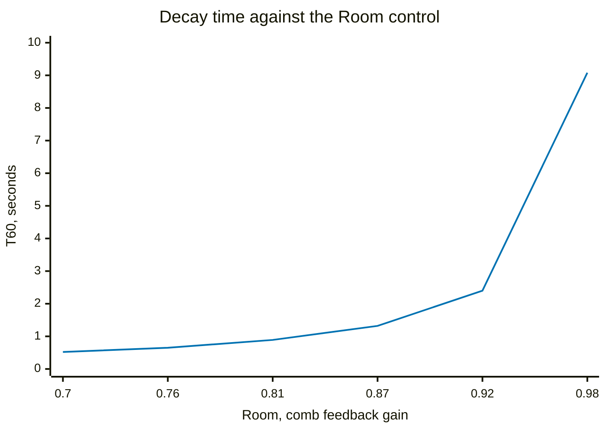
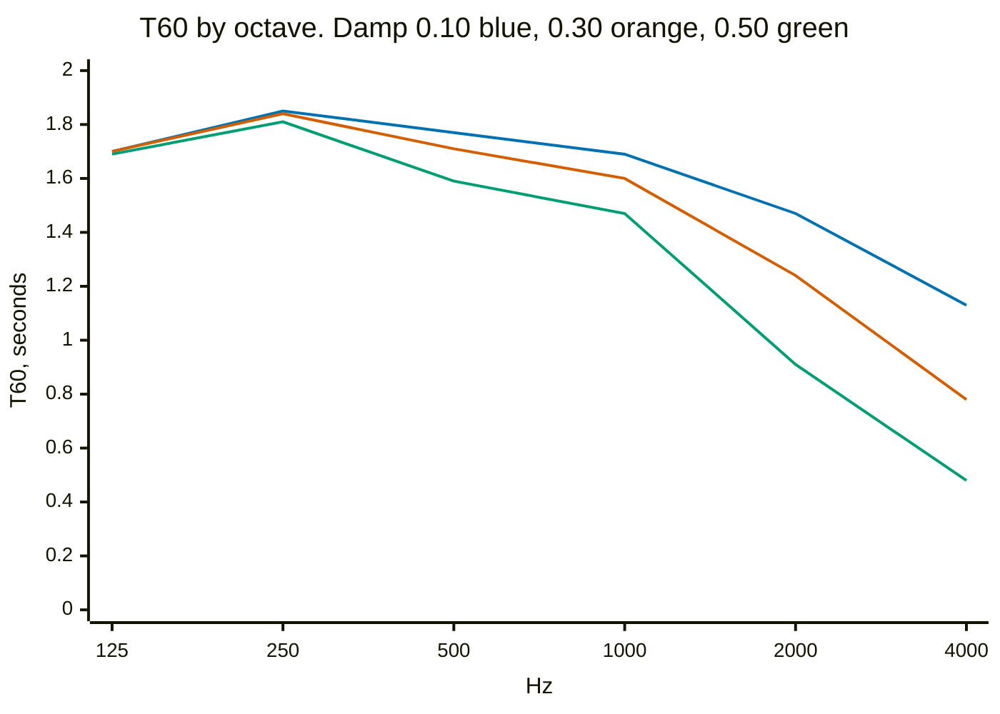
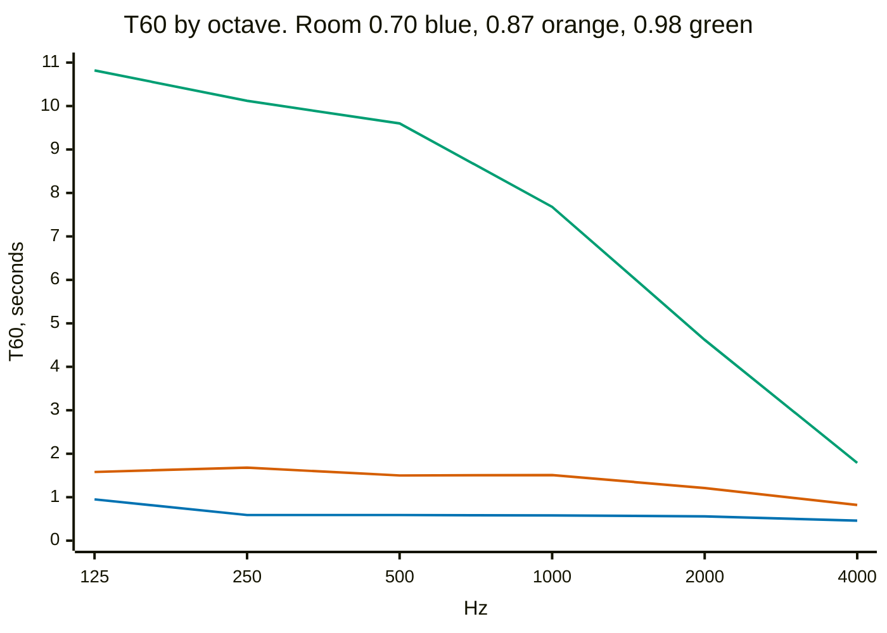
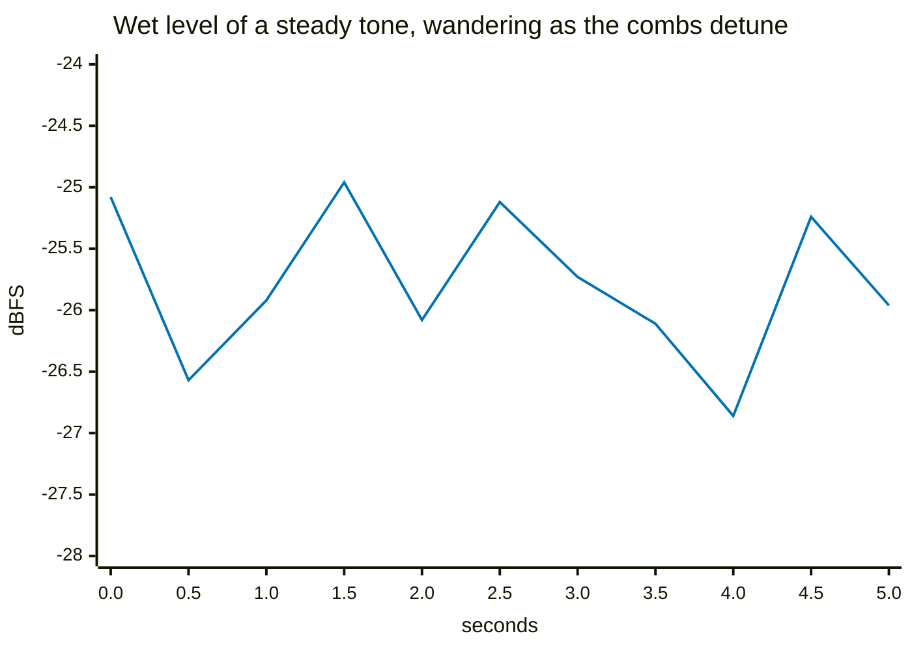

# Reverb `[REVERB]`

Freeverb — Schroeder-Moorer, by Jezar at Dreampoint, public domain. Eight
parallel feedback comb filters fed by the input, summed into four series
allpasses. Two controls: **Room** (0.70..0.98) is the feedback gain shared by
all eight combs, and **Damp** (0.1..0.5) is a one-pole lowpass inside each
comb's feedback loop. Defaults are 0.88 and 0.25, and it returns wet only, at
an 18% default mix.

Each comb's read pointer is swept ±6 samples by one of four slow LFOs, which is
the Lexicon trick for stopping a long tail ringing on a fixed set of
frequencies.

## Room is the decay time, and it is not linear in the knob

T60 is measured the standard way: Schroeder backward integration of the tail
after a gated noise burst, fitted from −5 dB to −25 dB and tripled.



Half a second to nine seconds, so the whole travel does something — but look at
the shape. The knob is linear in the feedback gain, and decay time goes as
roughly 1/(1−g), so it runs away at the top: **the first 80% of the pot covers
0.52 to 2.4 seconds, and the last 20% covers 2.4 to 9.1.**

That is not merely a steep curve, it is a curve whose steep end is where the
interesting settings live. It is the same shape of defect the compressor's Ratio
had — a control whose useful range is piled at one end of its travel — and it is
worth knowing about before reaching for the knob, because the top two
centimetres are where a room turns into a cathedral.

The default 0.88 gives 1.32 s, which is a plausible medium room and sits at
mid-travel where the control is still well behaved.

## Damp tilts the decay; Room scales it

Damp is a lowpass in the feedback path, so it does not shorten the tail evenly —
each pass round the loop takes a little more top off, and the highs run out
first. That is what a real room does, because air and soft furnishings both
absorb treble faster than bass.



The three lines are on top of each other at 125 Hz — 1.70, 1.70, 1.69 — and a
factor of 2.4 apart at 4 kHz. Damp does nothing whatever to the bottom of the
spectrum, by construction, and that is the correct behaviour rather than a
limitation.

Room, by contrast, scales the whole thing:



Note that the green line still slopes — at Room 0.98 the tail is 10.8 s at
125 Hz and 1.8 s at 4 kHz, a six-to-one tilt, because the damping compounds over
far more trips round the loop. So the two controls are not independent: a longer
room is also a darker one, at the same Damp setting.

## The modulation, and why the tail wanders

Eight fixed combs ring on a fixed set of frequencies, and a note that lands on
one of them sits there and hums. Sweeping each read pointer ±6 samples walks
those resonances instead — ±0.5% on a comb of 1215 samples — so nothing has a
fixed frequency to sit on.

You can see it directly. A steady 440 Hz tone, 100% wet, half-second windows —
the first 5.5 seconds of a 85-second capture:



The input never changes and the output wanders. That wander is the effect
working: it is the comb peaks sliding under a fixed tone.

**How far it wanders depends entirely on how long you watch**, and that is worth
stating because the first attempt at this got it wrong. The excerpt above covers
1.9 dB. Over the full 85 seconds it is **5.9 dB peak to peak**, with a standard
deviation of 1.08 dB and a p5..p95 spread of 3.4 dB. The slowest of the four
LFOs has a period of 4.8 seconds and they are spaced so as not to share one, so
a short capture does not sample the range — it samples whichever corner of it
the recording happened to start in. An eight-second capture reported 2.3 dB,
which is less than half the truth.

The chart is an excerpt rather than the whole run for a reason that is about
drawing rather than about reverb: eleven points is what the axis can label, and
eleven points spread over 85 seconds would put the window well above every rate
being looked at and average the wobble into a flat line.

The four LFOs run at 0.21, 0.31, 0.46 and 0.67 Hz — spaced about 3:2 so they do
not beat into a common period — and they are phase accumulators, which matters
more than it sounds. They used to be quadrature phasors rotated by a fixed
step, and nothing renormalised them: three of the four spiralled outwards and
one decayed to a tenth of its amplitude in ten minutes, so the reverb slowly
became the unmodulated version of itself and, left on overnight, walked its read
pointer out of the comb buffer entirely.

**The modulated read is interpolated.** Truncating it to a whole sample makes
the pointer jump, and a jump is a step discontinuity sprayed into the tail
continuously by eight combs at four rates. Measured by band-limiting the input
to 1 kHz and looking above 4 kHz, where a reverb that is time-invariant apart
from a sub-hertz modulation cannot legitimately put anything:

```
  input above 4 kHz    -78.3 dB of its total
  output above 4 kHz   -82.2 dB of its total
```

The output has *less* up there than the input did. It manufactures nothing.
Before the read was interpolated it manufactured 34.5 dB above what went in.

## What it costs

This is the expensive effect, and unlike everything else on this page the number
comes off the pedal rather than the bench — `Validation/measure-load.py`, which
reads the load meter over MIDI telemetry. Steps out of 127 of the sample period,
averaged over four boots:

| | reverb routed | share of the sample period |
|---|---|---|
| empty chain | — | 9.4 % |
| **reverb, as it is now** | **28.42 steps** | **22.4 %** |
| before the LFO and interpolation fixes | 26.15 | 20.6 % |
| with those fixes but a per-frame LFO | 33.54 | 26.4 % |

So one reverb is a fifth of the audio budget, which makes it comfortably the
most expensive effect here and the one to think about before stacking things
behind it.

The middle row is the honest cost of correctness: fixing the drifting LFOs and
interpolating the comb reads added 28.3%. Running the LFOs at control rate —
exact once every 32 frames, a straight line between — gave most of that back,
and the effect now costs 8.7% more than the broken version rather than 28.3%.
The remaining work is the comb read itself, which is irreducibly per-frame
because it reads audio.

## Reproducing this

```
cd Validation
make bench          # a stale bench measures a pedal you no longer have
./analyse-reverb.py
```

The cpu figures are not from that and will not be reproduced by it. They need
the pedal:

```
./measure-load.py -b 4
```

which sets routing live over SysEx, saves nothing, and reloads the scene when it
finishes. Read the note at the top of it before believing a single reading:
the empty-chain baseline wanders by a couple of steps between boots while the
routed reading holds still, so the number to compare between firmwares is the
routed absolute, averaged over several boots, and never a one-shot difference.
