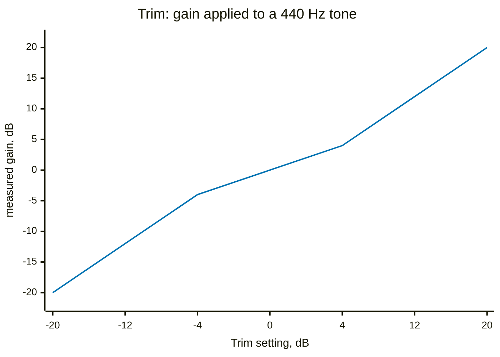
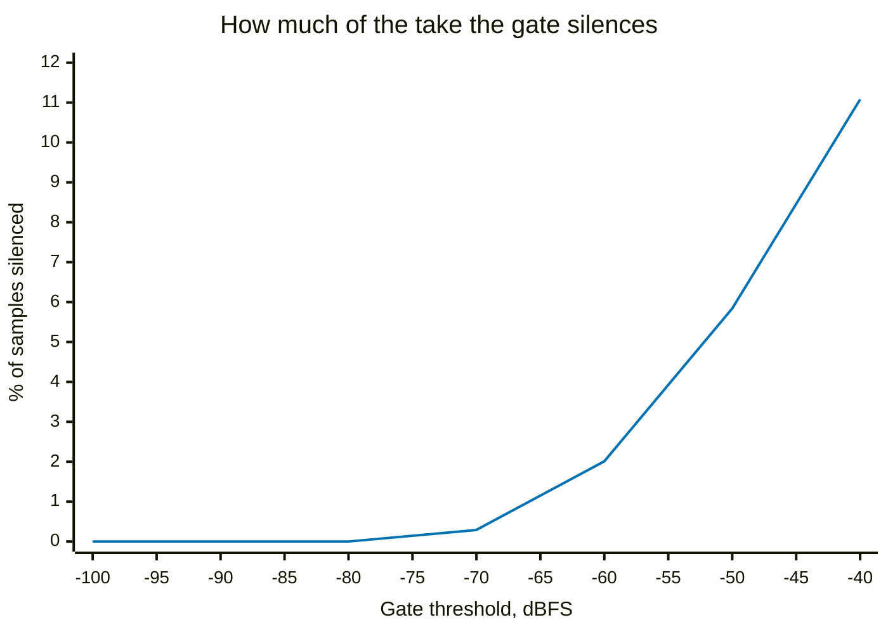
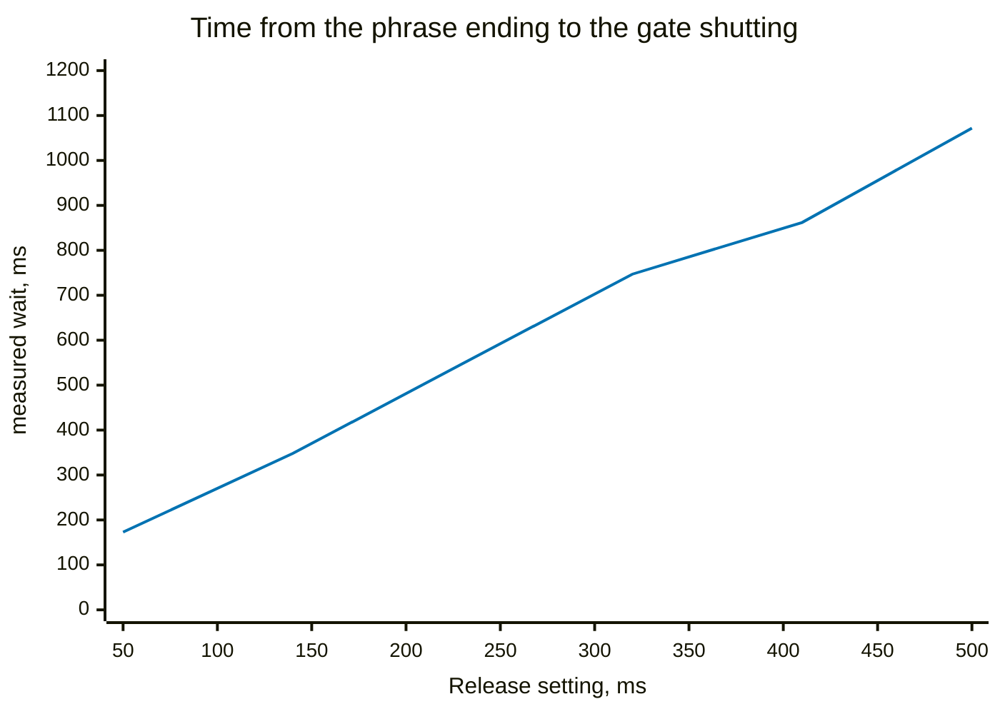
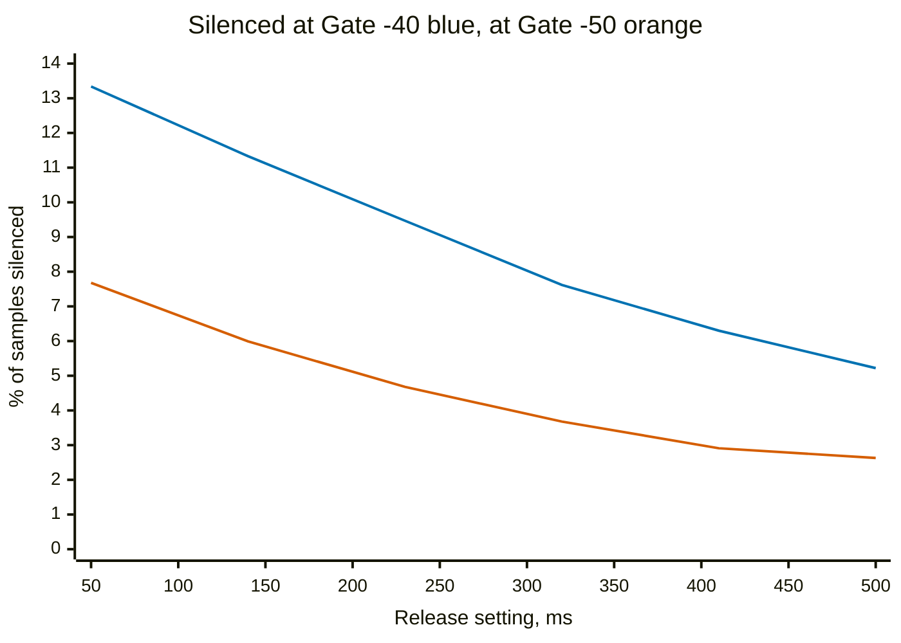
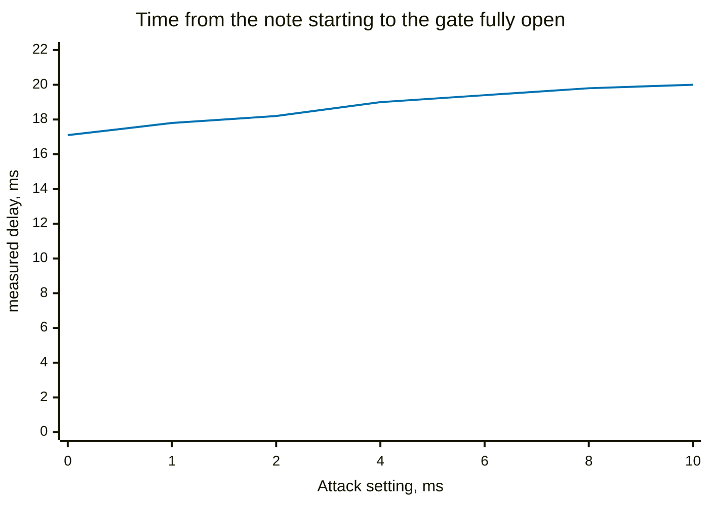
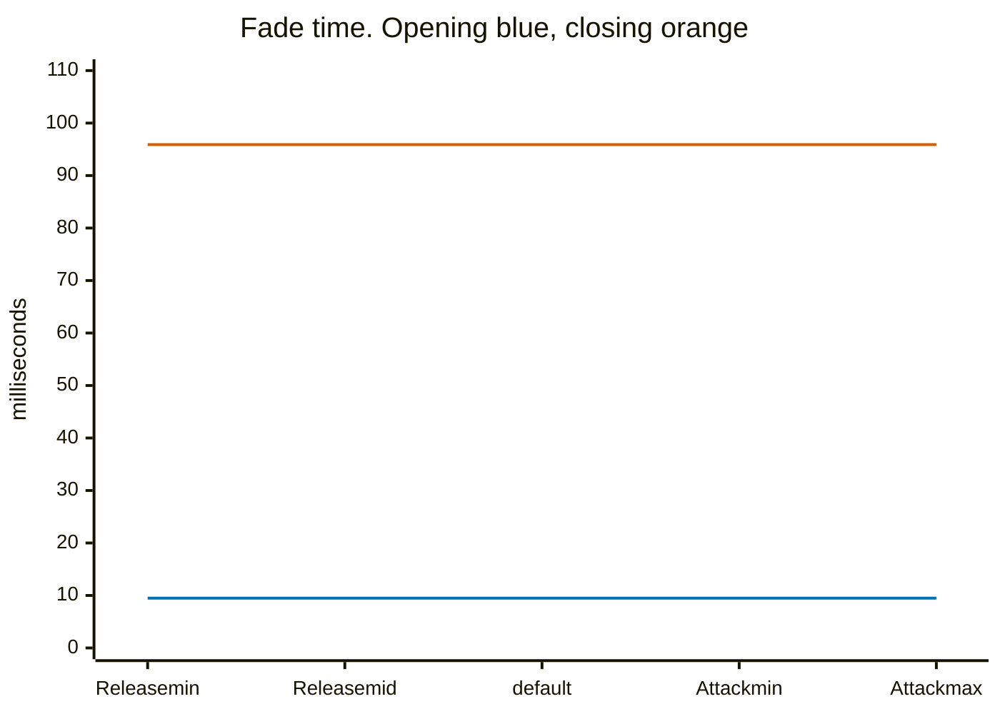

# Signal Chain `[CHAIN]`

Not an effect, and it does not pretend to be one. It is the two ends of the
chain: **Trim** (−20..20 dB) and **Gate** (−100..−40 dB) with its **Attack**
(0..10 ms) and **Release** (50..500 ms) at the front, and **Volume**
(−40..20 dB) at the back. It always runs, it is never in the routing, and it
has no wet/dry mix — a gain stage cannot be blended against itself.

## The two gains, which are exactly what they say



Volume is the same line shifted: −28.0, −16.0, −10.0, −4.0, +8.0 and +20.0 dB
at the settings that read that way. Both are exact to the second decimal, and
this section exists only so that the rest of the page is read against something
known to be boring.

The one wrinkle is at the bottom of Volume. Its range stops at −40 dB, but the
pot's zero is an explicit **silence** rather than −40, so that CC 7 at zero
means what a MIDI host means by it. −40 dB is a hundredth of an amplitude, so
the step from there to nothing is inaudible.

Trim and Volume are two controls rather than one because the chain between them
is full of things that are not linear. Where you sit on a triode curve, where
the boost starts folding, how far over the compressor's threshold you are — all
of that depends on the absolute level going in, and the DSP is calibrated to a
1 Vrms internal scale that any given guitar may miss by 20 dB either way. Trim
puts a pickup onto that scale; Volume then makes it as loud as you want without
disturbing any of it. Turn Trim up and Volume down by the same amount and you
hear the non-linearity by itself with the loudness held still, which is the only
honest way to judge it — louder always sounds better.

## The gate is three separate things

Everything interesting on this page is the gate, and it is built in three
pieces that are easy to confuse for one:

1. An **envelope follower** on the untrimmed input, with Attack and Release as
   its two time constants.
2. A **binary decision**: is that envelope above the threshold, or below it.
3. A **fixed ramp** that fades the gain between 0 and 1 once the decision
   flips.

**Attack and Release are the first piece only.** They are the detector's
ballistics — they decide *when* the gate changes its mind. They have nothing
to do with the third piece, which is where the fade actually happens and which
no control on the pedal can reach.

## What the threshold is worth

`Inputs/BassForLinus.mp3` is a friend of mine playing scales on a bass, 77
seconds of real dynamics, committed unmodified and scaled to −6 dBFS peak
(−25.9 dBFS RMS) for the same reasons the compressor page gives. Its quiet
passages sit around −57 dBFS and its 1st percentile is −78.



**At the default −70 dB this recording never gates at all** — 0.29% of it, which
is the space between takes and nothing else. That is not a criticism of the
default. A digital file has a noise floor no room has; the low end of the range
is aimed at a quieter input than any file on disk, and the number worth setting
it by is the floor meter, not this chart.

It does mean the rest of this page is measured with the threshold at the top of
its travel, −40 dBFS, because that is where both timing controls have something
to act on. Measuring a control somewhere it cannot act is how you conclude it
does nothing.

## Release: how long it waits

Measured as the time from a phrase ending — the input dropping below the
threshold and staying there — to the output actually reaching zero. Fourteen
such phrase ends in the take.



A six-to-one range across the knob, and every step of it moves. Note that the
measured wait is several times the number on the pot: the pot is a time
*constant*, and what is being timed is an exponential decay falling all the way
from the note's level to the threshold, which is several time constants' worth.
So the knob is a rate, and the wait it produces also depends on how loud the
note was and where the threshold sits.

That last dependency is worth seeing, because at a lower threshold the top of
the pot stops working altogether:



On the orange line the gate closes 8 times at 50 ms and **0 times at 500 ms** —
the envelope simply never gets down to the threshold before the next note
arrives. Both controls are live; it is that one can make the other inert, which
is the ordinary way two knobs on one detector interact rather than a fault in
either.

## Attack: about three milliseconds of say

The same measurement the other way round — from a note starting out of silence
to the output reaching full.



Monotonic, and much less than it looks. The whole travel moves the opening by
**2.9 ms**, on top of a floor of 17.1 ms that is there at every setting. The
floor is the fixed ramp plus the detector's own lag; the pot supplies the rest.

So Attack is a real control with a small authority, and the gate's opening
speed is mostly not up to it. This was checked against three thresholds and
three different definitions of where a note starts, because the first ruler
tried gave a much more dramatic answer that did not survive the second one.

## The ramp, which no knob touches



Two flat lines, and that is the point of the chart. The gate fades in over
**9.5 ms** and out over **95.9 ms**, and it does so at every setting of both
pots. The constants are written into `chain_step()`: `linear(0.01f, mult, 1.0f)`
going up and `linear(0.001f, mult, 0.0f)` coming down, each snapping to its rail
within a hundredth. That predicts ln(0.01)/ln(0.99) = 458 samples = 9.55 ms and
ln(0.01)/ln(0.999) = 4603 samples = 95.9 ms, which is what comes out.

**The ramp is about not popping**, and the asymmetry is deliberate and was set
by ear. It opens quickly because you do not want to lose the front of a note
when you start playing. It closes far more slowly because a long drawn-out
decay suddenly going away is very noticeable — much more noticeable than the
same amount of time spent opening. Whether 9.5 and 95.9 are the *right* numbers
is a fair question and they have never been measured against anything; what
they are is two values that sounded right.

## An honest doubt about the design

The ramp exists because the gate is a binary on/off decision on the envelope,
and a binary decision needs smoothing or it clicks. That is one design and not
obviously the best one. The alternative is a gate that has no decision and no
ramp in it at all: a multiplier that follows the envelope directly and clamps
at unity above the threshold, so the fade falls out of the envelope's own
ballistics and Attack and Release would then genuinely be the fade times.

What has kept it as it is, is a worry about amplitude modulation. A gain that
tracks the envelope closely is a gain that moves at the signal's own frequency,
and modulating a signal by something derived from itself is distortion — the
compressor page measures exactly this happening, at 11 dB per octave down,
which makes it a bass problem far more than a guitar one. A binary decision
plus a fixed ramp cannot do that, because the ramp's shape does not depend on
the signal level at all. It is a real trade and it has not been measured; the
current design is the cautious side of it.

## The trap this page was written around

The obvious way to measure a gate is to compare the total energy of the output
against the ungated output. Do not. Over this recording:

| Release | energy vs gate off | silenced |
|---|---|---|
| 50 ms | −0.01 dB | 13.34 % |
| 500 ms | −0.00 dB | 5.22 % |

The gate's behaviour changes by a factor of two and a half and the energy
number does not move. It cannot: everything a gate removes is, by construction,
quieter than the threshold, so it contributes almost nothing to a sum of
squares. An earlier attempt at this reported that Attack and Release "barely
change anything" on precisely that evidence. They change a great deal. What was
measured was the metric.

Everything above is therefore a timing, or a count, or a fraction of samples —
and never an average over the take.

## Reproducing this

```
cd Validation
make bench          # a stale bench measures a pedal you no longer have
./analyse-signal-chain.py
```

Needs `ffmpeg` for the decode, which is deterministic for a given ffmpeg; the
script prints the sample count, raw peak and scaled RMS first, so if those move
and nothing else changed, the decoder did.

The gate multiplier is recovered by dividing the gated output by the ungated
one, sample by sample — `chain_step()` applies the trim and the gate as one
scalar multiply, so the quotient is the firmware's own `chain.mult` exactly.
Where a note starts and ends is decided here, from the input, and never from
the firmware's envelope follower: that is the thing being measured, so it
cannot also be the ruler.
