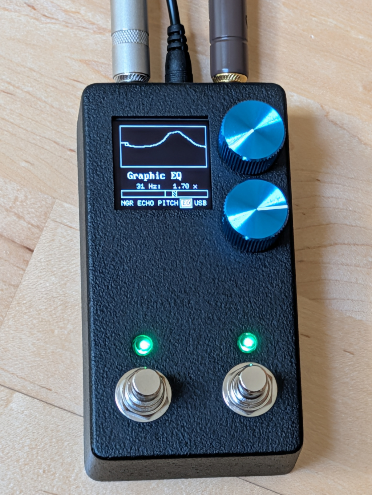
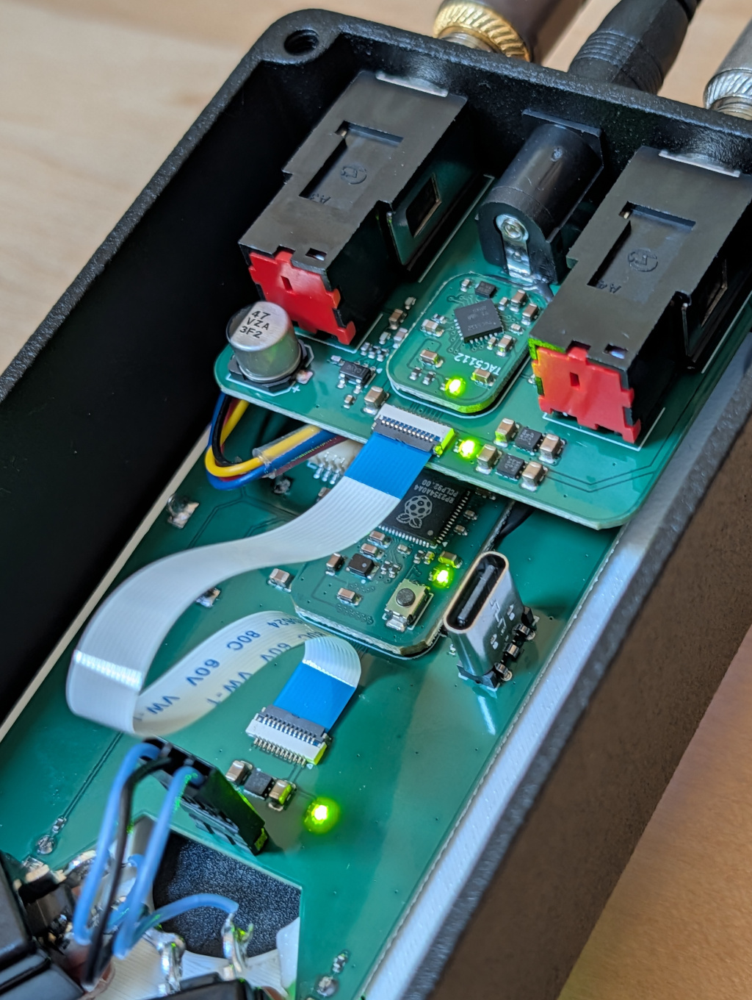

## Resurrected random guitar pedal project

This is a resurrected version of my old guitar pedal project, except
this time with a screen and a few rotary encoders instead of the old
horrid analog potentiometers.

There's a 'Hardware' directory with the kicad files.

There's a 'Software' directory that contains the firmware to make it do
something.

And there's a 'Documentation' directory, which is a very optimistic
thing for this project.

Anyway, with the update to have a screen and proper rotary encores, the
thing can now have multiple effects and a sane-ish UI to them.  Except
I'm not exactly known for my mad UI designing skillz.  So...

## Firmware

I've only ever built the firmware on Linux, but it *should* be perfectly
possible to build on MacOS or Windows too if you just figure out the
platform requirements. The project depends on the `pico-sdk` and
`tinyusb` libraries, and has submodules for both, so they get built
automatically, but the build tools your platform has to provide.

Regardless of platform, you'll need the basics:
 - git
 - make
 - python3
 - cmake

and a 32-bit arm cross-build environment.  On Linux, that would be
something like
 - arm-none-eabi-binutils-cs
 - arm-none-eabi-gcc-cs
 - arm-none-eabi-newlib

and if you have all the requirements, doing
```
	git clone https://github.com/torvalds/GuitarPedal.git
	cd GuitarPedal
	cd Software
	make prep
	make
```
should get the build going, and you should find the resulting
`blink.uf2` file in the `build/` subdirectory.  You can just write that
file to the USB filesystem after you've set the pedal into
programming mode (see below).

If you have installed picotool with USB support (the pico-sdk build only
builds a cut-down version without it), you can also just do ``make
flash`` to flash the image that way.

## Hardware

The kicad design files (and some supporting infrastructure, like the 3D
printed insert and the enclosure drill rules) are in the ``Hardware``
subdirectory.

The board files are perhaps somewhat strange, in that there are two
modular boards for the "core" hardware: the RP2354 microcontroller
(`Hardware/rp2354`) and the TI TAC5112 codec (`Hardware/codec`)
respectively.

Then there are boards for the audio and 9V DC power jacks
(`Hardware/audio-jacks`) with a connector for the codec board, and a
main board (`Hardware/pedal-board`) for the pedal IO (i2c connector for
the screen, USB-C programming port, rotary encoders, pin header for
stomp switches) which then has the connector for the rp2354
microcontroller board.

I'm using the nice HiRose BM28 series connectors on the modular boards.
They are absolutely tiny, which makes for a great board footprint but
admittedly also makes for a slightly more complicated board due to the
tiny 0.35mm pitch.  I'm not a fan of the traditional pin headers simply
because they make it so hard to do compact form factors.

The inter-board connector is a 12P 0.5mm FFC cable that carries power
and data lines (i2c for control, i2s for audio).

This modular design is purely so that I could try out different form
factors, and if you know what you want you should just put the TAC5112
directly on the audio jack board and the rp2354 on the IO board. The
modular setup makes for more complicated boards (the core boards have
components on both sides due to the connector, for example), but allowed
me to separate out the more complex and slightly more expensive boards
from the "let's try this layout" boards.

### Images




## Basic UI

The pedal has a 128x128 monochrome OLED screen and two rotary encoders
you can turn, and both of them also have switches so you can press down
on them to do things.  There are also two stomp-switches.

The top rotary is the "value" rotary, which changes the values when you
rotate it, and switches to the next value in the list when you press it
(you can also *hold* the rotary and rotate it at the same time, which
allows for moving back and forth in the effect value list, but most of
the time it's easier to just click forward).

The rotary below it is the "effect" rotary, which walks through the
effects in order when you rotate it.  You can also enable/disable each
effect by pressing it.

The left stomp switch is _also_ a "enable/disable current effect"
switch, but for your feet.  You do not want to stomp on the rotary
switches.

The right stomp switch is a "disable/enable the whole pedal" switch.

There are also two status LED's associated with the stomp switches: the
left one shows the "currently selected effect status", and the right one
shows "global status".

*Mostly* those status LEDs are just about on/off, but some effects will
also indicate whether they are in an active state by making the LED glow
more brightly.  For example, the noise gate will glow more brightly when
the signal is gated, and the compressor effect will glow more brightly
when it's compressing.

The "global status" LED can also glow more brightly, but it will do so
when things are bad: if the signal is hard-clipping past the range of
the output.  You typically wouldn't want that, but hey, maybe you really
want an insane boost with hard clipping that drives the amplifier to do
nasty things.

Finally, there is also a special 'reset sequence" - if you press and
hold *both* rotary switches, that is a reset signal, and if you are
connected to a computer over USB, the pedal will go into programming
mode.

If the pedal is powered on, but not connected over USB (so either using
the 9V guitar pedal power, or using USB from just a charger), the reset
sequence will reset all the effects - turn them off, and reset them to
default values.

## Audio effects

The current effects are:

 - Noise gate

This one is fairly simple.  Depending on how noisy your guitar
environment is, you may or may not need this one.  But particularly if
you use the boost effect very aggressively, you probably want it even if
you don't have a lot of 50Hz / 60Hz hum.

The default level is -70dBV, which is pretty quiet.

Anyway, 0dBV is very loud - most guitar levels are roughly in the -20dB
range (0.14V peak, aka 280mV peak-to-peak voltage).

-40dB is a "quiet sound" (14mV peak voltage), and -60dB is pretty much
silence.  So a -70dB noise gate *should* be a good starting point for a
good low-noise pickup.

That noise gate allows going down all the way to a -100dB noise floor,
which is ridiculously border-line for what the hardware can actually do.
But my environment and guitar is actually quiet enough that I
*can* go down to -85dB, and it will glow brightly to show that the gate
is on and the signal is smaller than that.

I'm actually pretty happy with that, in that it's about a 0.1mV
peak-to-peak signal.  It's not just that my guitar isn't picking up a
lot of noise from the environment, it also means that the pedal itself
is not noisy.

Alternatively, it just means that I got all the math wrong, and it's
lying to me.

There's also attack/release values that can tune just how the size of
the envelope is calculated, and how quickly it reacts to noise (and
how quickly it goes back to gating).

 - Compressor

This does what a compressor does.  Like a noise gate, there's a
attack/release to tune how the signal envelope is tracked.  It has a
"boost" setting to allow it to just boost the signal in general, but the
"level" is then the level at which it starts compressing.

The "ratio" is how aggressively it compresses signals that go over the
level (but the attack is also very relevant: the attack is about hoq
*quickly* - or slowly - it reacts to signals that go over the level).
So the "attack" basically says how quickly it starts reacting to a
signal that goes over, and then the ratio is how aggressive it is once
it starts reacting to it.

 - Boost (w/ distortion)

I like this one.  Others may not.

It can be used as just a clean boost - but so can the compressor.  But
what I like doing with it is to set it to some ridiculously high boost
value (like +20dB), and then set the *level* down to something fairly
low (like -20dB).

A +20dB signal boost is basically increasing the voltage level by 10x,
but then the "-20dB level" means that the "level" is set to 0.14V.

And what that boost effect does is that when the signal hits the voltage
level, it "folds" it down (or up, if it hit the negative level).  So the
+20dB boost will first make the signal much bigger, but then the level
folding will limit the end result to sane levels, but instead of just
clipping at that level, the signal folds down and you get higher
harmonics.

I think it sounds more interesting than the typical soft- or
hard-clipping effects.

 - phaser
 - flanger

Nothing particular about these.  They are very simple effects.

 - echo

This is the Echo King effect from Cleveland Music Co, converted from the
Hothouse example effects to this pedal.  All credit for it goes to Ricky
Sheaves, except if I screwed up in the conversion, in which case you get
to blame me.

It's a DSP model of the Maestro Echoplex family of tape delay.

 - pitch shifter

This one is almost certainly not useful, but it's fun.  It's a pitch
shifter, but it's *not* the smart kind of "do an FFT, shift frequencies
up or down".

Instead it's based on a delay loop, and walking the delay either faster
than realtime (shifting the pitch up) or slower than real-time (shifting
it down).  And then to avoid the sudden discontinuities when you have to
jump backwards (or forwards), it actually walks the delays in two
phases, and multiplies by a function that goes down to zero at the
discontinuity point (the function happens to be sine/cosine for the two
phases, but it could be something else).

End result: it does shift the pitch, but it also has a delay due to how
it's done.

*And* to make it sound even more complex, it has a feedback thing, so
it can feed back its own pitch-shifted signal into the delay loop, and
you get another pitch shifting (with an extra delay). So you can kind
of think of it as a short echo with a pitch shift.

It tends to sound most natural - which isn't saying much - with a +1
octave shift, but it isn't limited to whole octaves.  You can shift the
pitch up by random fractions.  Play around with it.

 - 10-band EQ

This is the most complicated from an actual algorithmic standpoint, and
also has the fanciest display.

Each band goes +-20dB (so 0.1 .. 10x). At the extremes, it will tend
to distort the signal - all the math is done in 32-bit
single-precision float, I won't guarantee it's entirely stable or
smooth.

 - "USB"

This doesn't affect the sound, but it turns the USB audio interface
logic on and off, and you can pick whether you want the stereo signal
to be either all dry, all wet, or "left channel wet, right channel
dry".

It's a work-in-progress. It works, but not entirely reliably.
