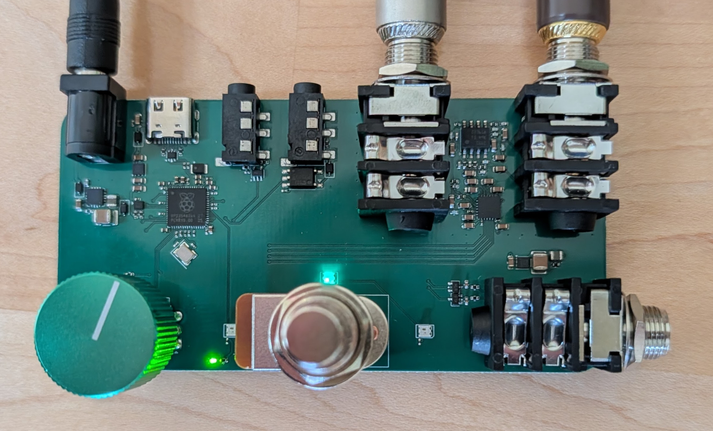
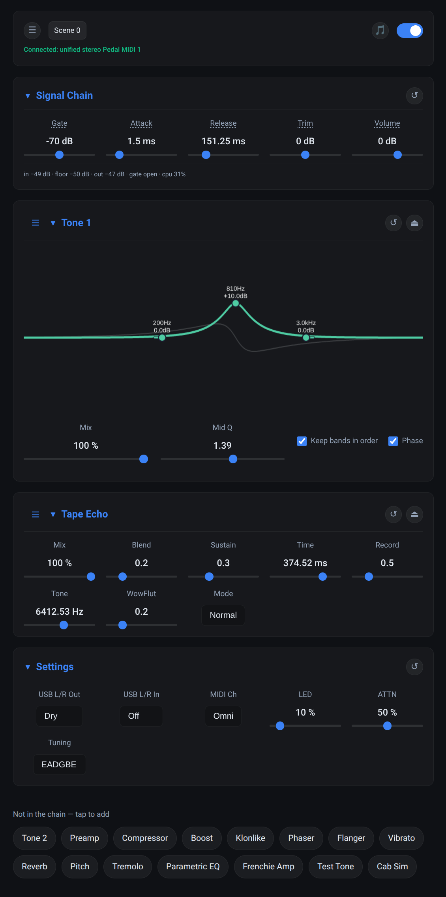

## Resurrected random guitar pedal project

This is a resurrected version of my old guitar pedal project: a digital
guitar pedal built around an RP2354A and a TI audio codec, with all the
effects done in software on a core of its own.

It went through a phase with a little OLED screen and a couple of rotary
encoders on it, and that's gone now.  Editing seventeen effects through a
128x128 screen and two knobs was never going to be pleasant, and I'm not
exactly known for my mad UI designing skillz, so the pedal itself is down
to one knob and one stomp switch and the deep editing happens somewhere
that already has a screen: there's a web app that talks to it over USB
MIDI from a browser.

So what's in here:

 - `Hardware` has the kicad files.
 - `Software` has the firmware that makes it do something, and
   `Software/WebMIDI` is the web app that edits it.
 - `Validation` is the test suite.  Some of it runs on your machine and
   some of it wants a pedal plugged in.
 - `Documentation` remains a very optimistic name for a directory.

## Firmware

I've only ever built the firmware on Linux, but it *should* be perfectly
possible to build on MacOS or Windows too if you just figure out the
platform requirements. The project depends on the `pico-sdk` and
`tinyusb` libraries, and has submodules for both, so they get built
automatically, but the build tools your platform has to provide.

Regardless of platform, you'll need the basics:
 - git
 - make
 - python3
 - cmake

and a 32-bit arm cross-build environment.  On Linux, that would be
something like
 - arm-none-eabi-binutils-cs
 - arm-none-eabi-gcc-cs
 - arm-none-eabi-newlib

There's more than one board this can be built for, and the build won't
guess.  You say which one this tree is about once, in
`Software/board.local`, and it stays said - it's a file rather than a
cmake cache variable specifically so that blowing away `build/` doesn't
silently change your mind for you.  So:
```
	git clone https://github.com/torvalds/GuitarPedal.git
	cd GuitarPedal
	cd Software
	echo unified > board.local
	make prep
	make
```
`unified` is the current one-board pedal.  The other is `split`, which is
the older modular pair of boards.  If you forget this step the configure
will stop and tell you, which is the intended behaviour - a wrong board
should be an error you fix once, not a working build for hardware you
don't have.

That gets you `build/pedal-unified.uf2` (and `.elf`, and `.bin`).  Every
artifact is named for the board it's for, so there is deliberately no
`pedal.uf2` to grab by mistake.  You can build the other board without
changing what the tree is about - ``make split`` - or both with ``make
all-boards``.

To get the `.uf2` onto the pedal you need it in BOOTSEL mode, and there
are two ways.  If it's running and plugged in, send it MIDI CC 20 with
value 126 and it will reboot into BOOTSEL on its own:
```
	amidi -l                          # find which card the pedal is
	amidi -p hw:5,0 -S "B0 14 7E"     # ...and that 5 is mine, not yours
```
Otherwise, hold the knob in while you plug it in.  The rotary encoder's
switch doubles as BOOTSEL on this board - through a Schottky, so that
QSPI traffic can't fake pulling it low - and that's the route that still
works on a pedal too broken to enumerate.  The older boards had a proper
BOOTSEL button, but it was on the little MCU daughtercard, which is fine
on a bench and useless the moment the thing is screwed into a box.

Either way a USB mass storage device shows up and you copy the file to
it.

If you have installed picotool with USB support (the pico-sdk build only
builds a cut-down version without it), you can skip all that and just do
``make flash``, which builds and flashes the board in `board.local`.
``make flash-split`` does the other one.

### Testing

`Validation` has the test suite, and it's split by what it needs.

``make check`` runs the part that needs no hardware at all: the MIDI
packetiser, whether the web app still loads and still draws the right
conclusions, and a sweep that asks every biquad in the pedal where it
actually landed.  ``make check-biquad`` is that last one on its own, and
``make check-effects`` puts signals through the effects themselves.

That last one works because of `Validation/bench`, which builds the
pedal's actual audio core - the same `single_sample()`, the same effect
headers, the same compiler flags - as a program on your machine that
takes float samples on stdin and hands them back on stdout.  It is not a
model of the signal path.  It's the signal path, with the two register
blocks the audio core touches replaced by ordinary memory.

Then there are the ones that want hardware: ``make check-hw`` with a
signal generator, ``make check-analog`` with a patch cable from the
pedal's output back to its own input, ``make check-bench`` to ask whether
a real board agrees with the host build, and ``make check-loop`` if you
have two pedals to patch into each other.

## Hardware

The kicad design files (and some supporting infrastructure, like the 3D
printed insert and the enclosure drill rules) are in the ``Hardware``
subdirectory.

These days it's just the one board.  `Hardware/usb-stomp` has the RP2354A
and the TI TAC5242 codec sitting directly on it, and that's the whole
pedal: no cable, no daughtercards, no connectors in between.

What's on it:

 - a 1/4" input jack and a 1/4" output jack
 - a third 1/4" jack for an expression pedal or a remote stomp switch
 - MIDI in and out, on 3.5mm "Type A" TRS jacks (out through a 5V
   buffer, in through an optocoupler, like MIDI has always wanted)
 - USB-C, and the usual 9V guitar pedal power jack
 - one rotary encoder with a switch under it, and one stomp switch
 - three addressable WS2812B LEDs

The MIDI jacks and the expression jack are the genuinely new things.  The
older boards had nowhere to put them - the expression jack in particular
wants two ADC pins, and those are exactly the pins the old MCU board was
spending on hardware MIDI, so it could not have existed there at all.

Fair warning on that expression jack, though: the hardware is done and
the firmware can read it, but only when the host asks it to over SysEx.
Right now it's a probe for figuring out what people actually plug in
there - expression pedals don't even agree on which contact is the wiper
- and nothing is wired up to *do* anything with the result yet.

### How it used to be

It used to be modular, and those board files are all still here.  There
were two little daughtercards for the "core" hardware - the RP2354
microcontroller (`Hardware/rp2354`) and the TI TAC5112 codec
(`Hardware/codec`) - plus a board for the audio and 9V DC power jacks
(`Hardware/audio-jacks`), and a main board (`Hardware/pedal-board`) for
the pedal IO: i2c connector for the screen, USB-C programming port,
rotary encoders, pin header for stomp switches.  The two halves were
joined by a 12P 0.5mm FFC cable carrying power and data lines (i2c for
control, i2s for audio).

That was mostly so I could try out different form factors.  It let me lay
the two halves out independently, and it was flexible enough to cram a
125B enclosure full of jacks, rotaries and the screen all in one top
area.  There was also a worry about noise isolation, which in the end
never had to be tested.

I used the nice HiRose BM28 series connectors on the modular boards.
They are absolutely tiny, which makes for a great board footprint but
admittedly also makes for a slightly more complicated board due to the
tiny 0.35mm pitch.  I'm not a fan of the traditional pin headers simply
because they make it so hard to do compact form factors.

Those boards are finished and they still work - the firmware builds for
them, and they're still useful for testing.  But what this section used
to say was that if you know what you want, you should just put the codec
directly on the audio jack board and the rp2354 on the IO board.  Which,
yes.  That's the board above.

### Images



The bare `usb-stomp` board, powered up.

## Basic UI

There's no screen.  The pedal has one knob, one footswitch and three
LEDs, and everything else happens in a browser.

### On the pedal

Out of the box the footswitch is bypass - tap for in-circuit or not, hold
it for the tuner - and the knob is the master volume, with either kind of
press on it putting the volume back where it started.  That last one
sounds trivial and isn't: it's the way back when you can't see anything.

But none of that is compiled in.  There are five gestures - turn the
knob, tap it, hold it, tap the switch, hold the switch - and what each
one means is a table the pedal looks up and the app writes.  You can
point the knob at any parameter of any effect, or make a single press
take one effect's mix up while it takes another's down.  A pedal with no
screen can't tell you what its knob is for, so that has to be settable
from something that can.

The three LEDs, left to right: something is wrong (red for clipping,
amber for dropped samples), in circuit or bypassed, and the chain is
busy - where "busy" means whatever the effect thinks it means, so the
gate lights it while it's gating and the compressor while it's
compressing.

### In the browser

`Software/WebMIDI` is a static web page that talks to the pedal over USB
MIDI.  There's nothing to install and it runs off a phone.

It doesn't know what the effects are.  It asks.  The pedal describes
every effect it has - every pot, the ranges, the units, the hover text -
and the app builds itself out of that, so it can't drift out of step with
the firmware, and adding an effect to the pedal makes it show up in the
app without touching the app.

What you actually do there is *route*.  There are seventeen effects and
none of them are in your signal path until you say so: routing picks
which ones run, and in what order, and the order is yours, because a
boost in front of a delay is a different pedal from a delay in front of a
boost.  Whatever you don't route costs nothing.

Pots are mostly just numbers, except where they aren't - the tone stacks,
the parametric EQ and the cab sim draw their actual frequency response,
so you can see the curve instead of inferring it from three knob
positions.



A tone stack with a 10dB mid bump at 810Hz and a tape echo behind it, and
the fifteen effects that aren't routed sitting at the bottom waiting to
be.  The faint grey line is the phase response.

Eight scenes fit in the pedal's own flash.  A scene is a routing plus
everything set inside it, and a MIDI program change recalls one, which is
half of what those MIDI jacks are for: a cheap footswitch can step
between scenes with no computer in sight.

## Audio effects

Seventeen of them, plus two that are always there and can't be unrouted:
the **Signal Chain** at the front, which is the input trim, the noise
gate and the master volume, and the **Settings** at the back, which is
USB audio routing, MIDI channel, LED brightness and what the tuner is
tuning to.

They're listed in the order they run in by default.  This is an overview
and not documentation - the app is the reference, because it gets the
ranges, the units and the hover text from the pedal itself rather than
from anything I typed here.

 - **Tone** - bass, mid and treble, with the corner frequencies
   adjustable and the mid's Q as well.  There are two of them, so one
   can go in front of a distortion and one behind it.
 - **Preamp** - a two-stage 12AX7 model, class-A biased with the
   asymmetry left in, and a JFET stage after it.
 - **Compressor** - level, ratio, attack, release, and a boost, so it
   can also just be a clean boost when that's what you want.
 - **Boost**, with distortion.  I like this one.  Others may not.  Set
   the boost stupidly high and the level low, and instead of clipping at
   the level the signal *folds* back down, which gives you harmonics
   that a soft or hard clipper doesn't.
 - **Klonlike** - the obvious model: 18V charge pump for headroom,
   germanium diodes, and the clean/dirty blend that tracks the gain
   knob.  Originally by Bryan Leavelle.
 - **Phaser**, **Flanger** and **Vibrato** - the modulation three.  All
   simple, all a delay line and an LFO wearing different hats.
 - **Tape Echo** - the Echo King from Cleveland Music Co, a model of the
   Maestro Echoplex tape delays, converted from the Hothouse examples.
   All credit to Ricky Sheaves, and blame me for the conversion.
 - **Reverb** - comb filters into allpasses, the traditional way.
 - **Pitch** - not the clever FFT kind.  It walks a delay line faster or
   slower than real time in two phases, crossfaded with a sine so the
   wrap doesn't click.  So it shifts *and* delays, and it feeds back into
   itself, which makes it a short echo that shifts again on every repeat.
   Most natural an octave up, but it does fractions.
 - **Tremolo** - amplitude modulation, several shapes.
 - **Parametric EQ** - five bands, two shelves and three peaks, every one
   of them tunable across the whole range.
 - **Frenchie Amp** - a small amp: triode, tone stack, power amp.
 - **Test Tone** - sine, triangle, saw or noise at a known level and
   frequency.  It replaces the input rather than adding to it, which is
   what lets the pedal measure itself.
 - **Cab Sim** - a speaker cabinet: resonance, presence, where the mic is
   pointed, and some cone breakup.
